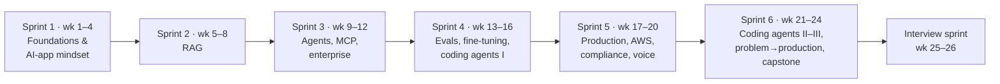
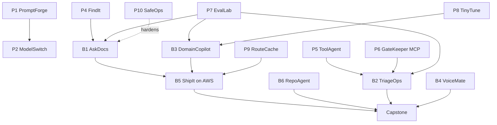

# Crio.Do Fellowship Program in AI Engineering — Brick-by-Brick Syllabus

Self-study version of the [Crio.Do Fellowship Program in AI Engineering](https://www.crio.do/) curriculum
(source: the programme's "Detailed Curriculum & Projects" page, saved copy). Topics, builds and success measures come from that page; the
brick splits and learning order are suggestions for self-study, in the same format as [SYLLABUS.md](SYLLABUS.md).

Comparison with the IIT Roorkee / iHUB DivyaSampark syllabus: [COMPARISON.md](COMPARISON.md).

## At a glance

| Item | Detail |
|---|---|
| Duration | 6 four-week build sprints (24 weeks) + 2-week interview sprint = 26 weeks |
| Live sessions | 60+ (10 per sprint, industry mentors) |
| Effort | ~10 hours/week; ~20 hours of take-home builds per sprint (~120 build hours) |
| Builds | 17 = 10 mini projects + 6 guided projects + 1 capstone, plus 4 optional self-builds |
| Assessment | Every build deployed, evaluated, auto-graded against a rubric (CI auto-grading, golden sets) |
| Cloud | AWS hands-on (Bedrock, AgentCore, SageMaker); Azure/GCP compared conceptually |
| Included | AWS sandbox with budget alarms, LLM API credits via a gateway, lab kit per build |
| Optional modules | Data Structures & Algorithms (300+ problems), System Design (LLD + HLD), self-paced |
| Outcome support | Interview sprint, résumé/LinkedIn review, 5 referral interviews |

## Prerequisites and pre-work

**Prerequisites:** Python proficiency (functions, classes, typing, packaging) · Git & GitHub (branching, PRs, basic CI)
· HTTP/REST & JSON · SQL basics (joins, aggregates, schemas) · command line & Docker basics.

**Pre-work (8–10 h):**

- [ ] P0.1 Lab-stack setup — Docker, Python, Node; bring up the standard lab stack; API keys via a gateway
- [ ] P0.2 Python-for-production-AI refresher — typing/Pydantic, async, packaging
- [ ] P0.3 ML concepts primer — bias/variance, metrics, model families

## Roadmap

### How the projects build on each other

---

## Sprint 1 — Foundations & the AI-App Mindset (weeks 1–4)

*How AI applications differ from traditional software, LLM building blocks, and an ML/DL refresher.*

- [ ] 1.1 How AI apps differ — non-determinism; the build → examine → decide loop
- [ ] 1.2 LLM foundations — tokenization, context windows, sampling, caching
- [ ] 1.3 LLM capabilities — tool calling, multimodal inputs
- [ ] 1.4 Prompt engineering
- [ ] 1.5 Context engineering — what goes into the context window and why
- [ ] 1.6 Structured (JSON) outputs and validation (Pydantic), retries on invalid output
- [ ] 1.7 Design patterns for AI apps — and when **not** to use AI/agents
- [ ] 1.8 Evaluation 101 — the error-analysis loop, a first eval harness
- [ ] 1.9 ML/DL refresher — bias/variance, metrics, transformers
- [ ] 1.10 Computer-vision primer — CNNs, transfer learning (PyTorch)
- [ ] 1.11 System-design recap for AI apps — API design, data models, auth, async

**Builds**

| # | Build | What you make | Proof it works |
|---|---|---|---|
| P1 | **PromptForge** (mini) | Messy text (emails, invoices, tickets, résumés) → validated JSON; prompt playground | Extraction accuracy on a labelled set; % valid on first try |
| P2 | **ModelSwitch** (mini) | Router across Claude, Gemini, OpenAI and a local model (Ollama) + first eval harness | Quality vs latency vs cost table per model |
| P3 | **SnapClassify** (mini) | Transfer-learning image classifier deployed as a web app, compared with a multimodal LLM | Accuracy, inference speed and cost: classifier vs LLM |

---

## Sprint 2 — Grounding with Data: RAG (weeks 5–8)

- [ ] 2.1 Embeddings, vector search, index types
- [ ] 2.2 Storage tiers and when to pick each
- [ ] 2.3 Chunking strategies
- [ ] 2.4 Parsing real documents (PDF/HTML/tables) into LLM-ready inputs
- [ ] 2.5 Hybrid search — dense + sparse fused with Reciprocal Rank Fusion
- [ ] 2.6 Re-ranking (cross-encoders)
- [ ] 2.7 RAG end-to-end with citations and groundedness
- [ ] 2.8 Agentic RAG — query rewriting, multi-hop
- [ ] 2.9 Beyond vectors — knowledge graphs; a semantic layer over SQL
- [ ] 2.10 Data engineering for AI — pipelines, quality & freshness, incremental sync
- [ ] 2.11 Retrieval evaluation — recall@k, faithfulness, golden sets, eval-in-CI

**Builds**

| # | Build | What you make | Proof it works |
|---|---|---|---|
| P4 | **FindIt** (mini) | Keyword + semantic search over a real dataset (e.g. product catalogue), RRF fusion, cross-encoder reranker | Recall@k before/after each step |
| B1 | **AskDocs** (guided) | Cited Q&A over real Notion/Google Drive docs: incremental-sync ingestion → chunking → hybrid retrieval + rerank → citations → conversation memory → guardrails (off-topic, injection) → agentic-RAG extension | Golden Q&A set; recall/precision, faithfulness, LLM-judge quality, latency & cost per query; evals in CI. Ships: live assistant + eval report + cost/latency dashboard |

---

## Sprint 3 — Agents, Protocols, MCP & Enterprise Integration (weeks 9–12)

- [ ] 3.1 The agent loop; workflows vs agent harness
- [ ] 3.2 Tool/function calling in depth
- [ ] 3.3 Agent design patterns — ReAct, plan-and-execute, reflection, router
- [ ] 3.4 Memory and context for agents
- [ ] 3.5 MCP servers — multi-tenant scoping, RBAC at the tool boundary, audit logs
- [ ] 3.6 Multi-agent orchestration; vendor agent SDKs compared with LangGraph
- [ ] 3.7 Agent communication protocols — A2A / ACP; typed schemas and state machines for reliable messaging
- [ ] 3.8 Human-in-the-loop, guardrails, safe write-actions and permissions
- [ ] 3.9 Agent evaluation and tracing
- [ ] 3.10 Integrating real systems — OAuth/SSO, webhooks
- [ ] 3.11 Text-to-SQL agent with a verification loop

**Builds**

| # | Build | What you make | Proof it works |
|---|---|---|---|
| P5 | **ToolAgent** (mini) | ReAct agent calling a live API (GitHub, weather, helpdesk) with error handling, retries, basic guardrails | Task-completion rate, tool-call accuracy |
| P6 | **GateKeeper MCP** (mini) | Multi-tenant MCP server: real tools, per-tenant scoping, RBAC, OAuth, audit logs | Tenant A cannot see tenant B; complete audit trail |
| B2 | **TriageOps** (guided) | Supervisor + classifier + grounded responder + escalation agents on a real helpdesk, tools via GateKeeper MCP, human approval on writes, tracing, guardrails, PII redaction | Classification accuracy, deflection rate, reply quality, tool-call accuracy, escalation precision, cost per ticket. Ships: deployed agent + trace/eval console. Stretch: billing hand-off, multilingual |

---

## Sprint 4 — Eval-Driven Development, Fine-Tuning & Coding Agents I (weeks 13–16)

- [ ] 4.1 Deterministic vs LLM-as-judge vs human evaluation
- [ ] 4.2 Building eval sets from production traces
- [ ] 4.3 Regression testing; evals as a CI deploy gate; evaluate-your-evals (judge calibration)
- [ ] 4.4 Prompt vs RAG vs fine-tune; the PEFT landscape (LoRA, QLoRA, adapters)
- [ ] 4.5 Hands-on fine-tuning with 4-bit quantisation; before/after evaluation
- [ ] 4.6 Post-training concepts — DPO, RL-style methods, reasoning models
- [ ] 4.7 Distillation, quantisation, serving fine-tuned models (vLLM/Ollama); publishing to a model hub
- [ ] 4.8 Coding agents I — how a harness wraps an LLM; plan → execute → deploy workflow

**Builds**

| # | Build | What you make | Proof it works |
|---|---|---|---|
| P7 | **EvalLab** (mini) | Eval sets from real failures, calibrated LLM-judge, regression tests in GitHub Actions that catch a planted regression | Gate blocks the regression; judge–human agreement |
| P8 | **TinyTune** (mini) | Dataset prep, 4-bit QLoRA fine-tune with Hugging Face, before/after eval, distillation demo | Gain vs base; cost/latency vs frontier API |
| B3 | **DomainCopilot** (guided) | Fintech/health/legal copilot: dataset curation → QLoRA → adapter on a model hub → served (vLLM/Ollama) behind RAG → side-by-side eval → model card with data provenance & PII handling | Win-rate vs base (judge + human sample), faithfulness, latency, cost per 1,000 queries vs frontier API. Stretch: DPO, distillation |

---

## Sprint 5 — Production, Cloud, Compliance & Real-Time (weeks 17–20)

- [ ] 5.1 Observability and tracing (Langfuse)
- [ ] 5.2 Drift, statistical regression testing, incident fire-drills
- [ ] 5.3 Cost & performance — routing, semantic + prompt caching (Redis), token budgets, cost-per-query
- [ ] 5.4 Security, governance & compliance literacy — injection, PII (Presidio), guardrails, audit
- [ ] 5.5 Deployment — containers, CI/CD with eval gates, versioning and rollbacks, scaling LLM APIs
- [ ] 5.6 Cloud AI ecosystems — AWS Bedrock + AgentCore, SageMaker; Azure/GCP introduced
- [ ] 5.7 Hands-on AWS — productionise an earlier build with monitoring and cost alarms
- [ ] 5.8 Real-time & voice — cascaded vs realtime speech, LiveKit, interruption (barge-in) patterns, latency and cost

**Builds**

| # | Build | What you make | Proof it works |
|---|---|---|---|
| P9 | **RouteCache** (mini) | Gateway routing to the cheapest capable model + semantic/prompt cache + token budgets + cost dashboard | Cost and latency before vs after on the same traffic |
| P10 | **SafeOps** (mini) | Tracing (Langfuse), PII redaction (Presidio), blocked injection, drift alert (Prometheus/Grafana) on an earlier build | Trace per request, redaction tests, blocked attack in logs, fired drift alert |
| B4 | **VoiceMate** (guided) | LiveKit voice support agent: cascaded STT→LLM→TTS vs speech-to-speech choice, tool use, barge-in, latency budget, voice guardrails | Latency percentiles, task completion, interruption handling, WER, cost per minute |
| B5 | **ShipIt** (guided) | AskDocs or DomainCopilot on AWS (Bedrock/AgentCore or SageMaker): containers, eval-gated CI/CD, traces/metrics/alerts, cost alarms, rollback plan, incident fire-drill, runbook, handover doc | Deploy-gate pass rate, p95 latency, error/retry rate, monthly cost vs budget, time-to-recover |

---

## Sprint 6 — Coding Agents II–III, Problem → Production & Capstone (weeks 21–24)

- [ ] 6.1 Coding agents II — autonomy levels, safe permissions, md-files (AGENTS.md/CLAUDE.md), hooks, MCP, parallel agents
- [ ] 6.2 Coding agents III — behavioural + functional tests, agentic code review, security/architecture audits
- [ ] 6.3 Problem → production I — framing the right problem, success metrics, one-page spec, MVP vs careful build
- [ ] 6.4 Problem → production II — real constraints: existing systems, data, security, tenancy; stack decisions
- [ ] 6.5 Problem → production III — deploy, hand over, own: eval gates, fire-drills, runbooks, stakeholder demos
- [ ] 6.6 Production-hardening clinic — multi-agent failure modes, RAG at scale, cost under load
- [ ] 6.7 Capstone clinics and demo day

**Builds**

| # | Build | What you make | Proof it works |
|---|---|---|---|
| B6 | **RepoAgent** (guided) | A real feature in a large open-source repo using Claude Code/Cursor: spec → plan → AGENTS.md/CLAUDE.md, hooks, MCP → build → agentic review + AI security audit → tests + eval suite → merge-quality PR | Tests pass, review findings closed, eval suite, time-to-PR, tokens/cost. Stretch: parallel agents |
| CAP | **Capstone** | Your own product (industry menu or own problem): one-page spec, metrics, build, deploy on AWS, evaluate, monitor | Demo day: live demo, eval report, next steps |

---

## Interview sprint (weeks 25–26)

- [ ] I.1 Agentic system-design rounds — research agents, text-to-SQL over large schemas, multi-agent coordination
- [ ] I.2 Ambiguous-problem decomposition — clarify, decompose, propose a 4-week scope, name the riskiest assumption
- [ ] I.3 Behavioural preparation; communicating technical trade-offs
- [ ] I.4 Security & architecture interrogation (question bank)
- [ ] I.5 Portfolio walkthrough & architecture defence; résumé/LinkedIn review

Targets AI Engineer and Forward Deployed Engineer (FDE) roles.

## Optional self-builds (from Sprint 5)

| # | Build | Scenario | Pattern |
|---|---|---|---|
| O1 | AutoClaims Assist | Insurance auto-claims triage: multi-agent + MCP + RAG over reports, photos, estimates; human review; audit | Regulated multi-agent decisioning |
| O2 | MedAuth Assist | Hospital prior-authorisation co-pilot with policy retrieval, citations, PII redaction, audit, SSO | Compliance-first co-pilot |
| O3 | CallReview | Diarised transcription → summary → 5-dimension QA scorecard → compliance flags; batch + streaming | Speech-analytics pipeline |
| O4 | QueryPilot | Text-to-SQL over a 200-table warehouse: semantic layer, schema retrieval, sandboxed execution, verification loop, charts | Agents over structured data |

## Optional modules (self-paced)

| Track | Courses |
|---|---|
| Data Structures & Algorithms (300+ problems) | DSA-101 Beginner · DSA-102 Problem-solving foundations · DSA-201 Intermediate · DSA-202 Trees, graphs & recursion · DSA-203 Advanced DSA & DP (4 weeks each) |
| System Design | LLD-201 Foundations · LLD-202 Advanced · LLD-203 Machine coding & interview practice · HLD-301 Architecture choices · HLD-302 Distributed-system scenarios · HLD-303 Building for scale on the cloud |

## Tools named in the curriculum

Python, Pydantic, Docker, Node, PyTorch, Ollama, Claude/Gemini/OpenAI APIs, vector DBs, cross-encoder rerankers,
LangGraph, vendor agent SDKs, MCP, OAuth/SSO, GitHub Actions, Hugging Face (PEFT, 4-bit quantisation), vLLM,
Langfuse, Presidio, Redis, Prometheus, Grafana, AWS Bedrock, AgentCore, SageMaker, LiveKit, Claude Code, Cursor,
Notion and Google Drive APIs.

## Progress tracker

| Block | Builds | Status |
|---|---|---|
| Pre-work | Lab stack | Not started |
| Sprint 1 | P1 PromptForge · P2 ModelSwitch · P3 SnapClassify | Not started |
| Sprint 2 | P4 FindIt · B1 AskDocs | Not started |
| Sprint 3 | P5 ToolAgent · P6 GateKeeper MCP · B2 TriageOps | Not started |
| Sprint 4 | P7 EvalLab · P8 TinyTune · B3 DomainCopilot | Not started |
| Sprint 5 | P9 RouteCache · P10 SafeOps · B4 VoiceMate · B5 ShipIt | Not started |
| Sprint 6 | B6 RepoAgent · Capstone | Not started |
| Interview sprint | Practice rounds, portfolio | Not started |
| Optional | O1–O4, DSA, System Design | Not started |
