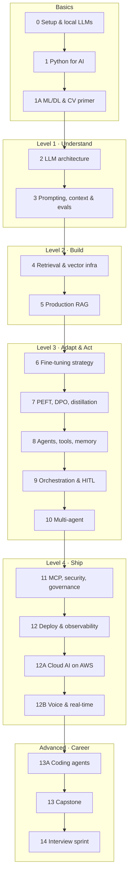

# AI Agents & RAG — Unified Brick-by-Brick Syllabus (Basics → Advanced)

One self-study path that combines two programmes:

- [IIT Roorkee PG Certificate in Agentic and RAG Systems for AI Engineering](https://ihub-iitroorkee.emeritus.org/iitr-post-graduate-certificate-in-agentic-and-rag-systems-for-ai-engineering) (iHUB DivyaSampark with Emeritus, Batch 2): the base structure
- [Crio.Do Fellowship Program in AI Engineering](CRIO_SYLLABUS.md): its extra topics and builds, folded in where they fit

Why both: [COMPARISON.md](COMPARISON.md). Living tracker: <https://claude.ai/code/artifact/274efa6c-5971-4df1-8624-c27d3571b517>

## How to use this syllabus

Work through **19 modules in order**, from basics to advanced. That is about 1 setup week plus 32 weeks at
8–10 hours a week. Every module ends in a working build in this repo.

- **One brick at a time.** Each module splits into numbered bricks (1.1, 1.2 …). Finish one brick, run its exercise, then move on.
- **Build, then measure.** Move on only once a module's checkpoint passes.
- **Everything compounds.** The Phase 1 service becomes the RAG system, then the agent, then the deployed capstone.
- **Local models first.** Every brick runs on free local models through Ollama first; hosted providers are added one at a time.
- **Free tools first**; paid tiers and cloud are optional, but use free credits for AWS in Module 12A.
- **Weekly rhythm:** ~3 h concepts, ~5 h coding, ~1 h notes on what worked and what broke.
- **Hardware:** 4+ cores, 16 GB RAM recommended; fine-tuning uses a free Colab GPU.

**Tags on bricks:**

| Tag | Source |
|---|---|
| *(none)* | IIT Roorkee / DivyaSampark programme |
| **[Crio]** | Crio.Do curriculum, not in the IIT programme |
| **[Both]** | In both, with Crio adding a build or depth |
| **[Added]** | Neither programme; added for self-study |

Module numbers 0–13 match the notes files in [`notes/`](notes/). Lettered modules (1A, 12A, 12B, 13A) and Module 14
are new from Crio, with notes files `01a-`, `12a-`, `12b-`, `13a-` and `14-`.

## Model strategy: local first, then one provider at a time

| Stage | When | Provider / runtime | What you learn |
|---|---|---|---|
| 1 | Module 0 onward | **Ollama** (Llama 3.x, Qwen, Mistral, Phi, Gemma; `nomic-embed-text`) | Free, private, offline LLMs; OpenAI-compatible local API |
| 2 | Module 2 | **LM Studio / llama.cpp** | GGUF files, quantization, CPU vs GPU speed |
| 3 | Module 2 | **Hugging Face** | Open-model ecosystem, model cards, licences |
| 4 | Modules 2–3 | **Groq / OpenRouter** free tiers | Hosted open models, rate limits |
| 5 | Module 3 | **OpenAI** | Proprietary API, structured outputs, function calling |
| 6 | Module 3 | **Anthropic (Claude)** | Tool use, long context, prompt caching |
| 7 | Module 3 | **Google (Gemini)** | Multimodal input, long context |
| 8 | Module 12 | **LiteLLM** router | One interface, routing, fallbacks, cost tracking |
| 9 | Module 12A | **AWS Bedrock** [Crio] | Managed models on a hyperscaler |

## Roadmap at a glance

| Level | Module | Weeks | Build | Source build |
|---|---|---|---|---|
| Basics | 0 Setup and Local LLMs | 0 | Hello local LLM | — |
| Basics | 1 Python for AI Engineering | 1–3 | Tested LLM API service | — |
| Basics | 1A ML/DL Refresher & Computer-Vision Primer [Crio] | 4 | SnapClassify | Crio P3 |
| 1 Understand | 2 LLM Architecture and Model Ecosystem | 5–6 | Model benchmark + router (ModelSwitch) | Crio P2 |
| 1 Understand | 3 Prompting, Context Engineering, Evaluation | 7–8 | Prompt Lab + PromptForge | IIT P1, Crio P1 |
| 2 Build | 4 Retrieval and Vector Infrastructure | 9–11 | Mini-RAG + FindIt | IIT P2, Crio P4 |
| 2 Build | 5 Production RAG Optimisation | 12–14 | Grounded Q&A / AskDocs | IIT P3, Crio B1 |
| 3 Adapt & Act | 6 Fine-Tuning Strategy | 15 | Decision log | — |
| 3 Adapt & Act | 7 PEFT, Post-Training, Distillation | 16–17 | Specialise a Model / TinyTune → DomainCopilot | IIT P4, Crio P8, B3 |
| 3 Adapt & Act | 8 Agents, Tools, Memory | 18–19 | Tool-Using Agent / ToolAgent | IIT P5, Crio P5 |
| 3 Adapt & Act | 9 Orchestration and Human Oversight | 20 | LangGraph agent with approval gate | — |
| 3 Adapt & Act | 10 Multi-Agent Coordination | 21 | TriageOps | Crio B2 |
| 4 Ship | 11 MCP, Security, Governance | 22–23 | Connected Assistant / GateKeeper MCP | IIT P6, Crio P6 |
| 4 Ship | 12 Deployment, Observability, Operations | 24–25 | EvalLab + RouteCache + SafeOps | Crio P7, P9, P10 |
| 4 Ship | 12A Cloud AI on AWS [Crio] | 26 | ShipIt | Crio B5 |
| 4 Ship | 12B Voice and Real-Time Agents [Crio] | 27 | VoiceMate | Crio B4 |
| Advanced | 13A Coding Agents [Crio] | 28–29 | RepoAgent | Crio B6 |
| Advanced | 13 Capstone: Problem → Production | 30–31 | Your own product | Both |
| Career | 14 Interview Sprint [Crio] | 32 | Mock rounds, portfolio defence | Crio |

---

## Modules, brick by brick

### Module 0 — Setup and Local LLMs (week 0) [Added]

- **0.1 Dev environment:** Python 3.11+, `uv`, Git and GitHub, VS Code, Jupyter.
- **0.2 Ollama:** install, pull and chat with small models.
- **0.3 Hardware sizing:** model size vs RAM; GGUF and quantization basics.
- **0.4 Calling a local model from Python:** Ollama API and OpenAI-compatible endpoint; streaming.
- **0.5 Local embeddings:** `nomic-embed-text`.
- **0.6 Working with AI coding assistants** responsibly.
- **0.7 Lab stack [Crio]:** Docker basics, Node install, HTTP/REST and SQL refresher (Crio prerequisites).

**Build:** script that streams a local model's answer and prints tokens/second. **Checkpoint:** works on two models by changing one setting.

### Module 1 — Python for AI Engineering (weeks 1–3)

- **1.1 Modern Python refresher:** data structures, functions, OOP, dataclasses.
- **1.2 Project hygiene:** `uv`, `.env`, secrets, JSON parsing.
- **1.3 Pydantic validation** of LLM output.
- **1.4 Async and concurrency.**
- **1.5 Robust API calls:** retries, backoff, timeouts, structured logging.
- **1.6 Pipeline-oriented coding.**
- **1.7 FastAPI basics.**
- **1.8 Testing:** pytest, mocking an LLM; testing vs evaluation.
- **1.9 System design for AI apps [Crio]:** API design, data models, auth, async jobs.

**Build:** FastAPI `/ask` service with Pydantic, retries and offline tests. **Checkpoint:** tests pass with no network.

### Module 1A — ML/DL Refresher and Computer-Vision Primer (week 4) [Crio]

- **1A.1 What machine learning is:** training vs inference, features, labels, train/val/test split.
- **1A.2 Bias vs variance; overfitting and underfitting.**
- **1A.3 Metrics:** accuracy, precision, recall, F1, confusion matrix.
- **1A.4 Model families:** linear models, trees, neural networks, transformers.
- **1A.5 Neural networks and backpropagation** (intuition, PyTorch basics).
- **1A.6 CNNs and transfer learning** for images.
- **1A.7 Classical model vs multimodal LLM:** when a small model is cheaper, faster and better.

**Build — SnapClassify:** fine-tune a pretrained image model in PyTorch, deploy as a small web app, compare with a multimodal LLM.
**Checkpoint:** table of accuracy, speed and cost: classifier vs LLM.

### Module 2 — LLM Architecture and Model Ecosystem (weeks 5–6)

- **2.1 Math essentials [Added]:** vectors, cosine similarity, softmax, temperature, top-p.
- **2.2 Tokens, embeddings, positional encoding.**
- **2.3 The Transformer:** attention, decoder-only models.
- **2.4 Context windows** and long-context trade-offs.
- **2.5 Model ecosystem:** GPT, Claude, Gemini, Llama, Mistral, Qwen; open vs proprietary.
- **2.6 Reasoning models and small language models [Both].**
- **2.7 Structured outputs and streaming.**
- **2.8 Multimodal inputs [Crio]:** images and documents in prompts.
- **2.9 Caching inside LLM APIs [Crio]:** prompt caching basics.
- **2.10 Cost, latency, quality trade-offs.**
- **2.11 Multi-provider router [Crio]:** one gateway over local + hosted models.

**Build — Model benchmark + ModelSwitch:** route the same tasks to 3+ models (local first) and record quality, latency, tokens, cost.
**Checkpoint:** a model choice defended with your own numbers.

### Module 3 — Prompt Engineering, Context Engineering, Evaluation and Reliability (weeks 7–8)

- **3.1 Core prompting:** zero-shot, few-shot, system prompts.
- **3.2 Reasoning prompts:** chain-of-thought, tool-aware, retrieval-aware.
- **3.3 Safety and hallucination mitigation.**
- **3.4 Prompts as code:** templates, versioning.
- **3.5 Context engineering [Crio]:** choosing, ordering and trimming what goes into the context window.
- **3.6 Design patterns for AI apps [Crio]:** and when **not** to use AI or agents.
- **3.7 The error-analysis loop [Crio]:** build → examine failures → decide.
- **3.8 Evaluating LLMs:** golden datasets, LLM-as-judge, pairwise, critic–creator.
- **3.9 Eval tooling:** RAGAS, DeepEval; reliability over repeated runs.
- **3.10 Adding hosted providers [Added].**
- **3.11 DSPy [Added, optional].**

**Build — Prompt Lab + PromptForge:** three prompting strategies scored on a golden set; a structured-output extractor (messy text → validated JSON, with retries).
**Checkpoint:** accuracy per strategy; % of outputs valid first time.

### Module 4 — Retrieval Architecture and Vector Infrastructure (weeks 9–11)

- **4.1 Why RAG.**
- **4.2 Embedding models.**
- **4.3 Document parsing [Both]:** PDF, HTML, tables, OCR.
- **4.4 Chunking strategies.**
- **4.5 Vector databases and indexes:** FAISS, Chroma, Qdrant; HNSW, IVF.
- **4.6 Storage tiers [Crio]:** in-memory vs embedded vs server vs managed; when to pick each.
- **4.7 Ingestion pipelines and metadata.**
- **4.8 Data engineering for AI [Crio]:** pipelines, data quality and freshness, incremental sync.
- **4.9 Real sources [Crio]:** connecting Notion or Google Drive.
- **4.10 Hybrid retrieval basics.**
- **4.11 Knowledge lifecycle and PII.**
- **4.12 Frameworks [Added]:** LangChain, LlamaIndex.

**Build — Mini-RAG, then FindIt:** RAG over your own documents; then a hybrid keyword + semantic search over a real dataset.
**Checkpoint:** grounded, cited answers; recall@k measured.

### Module 5 — Production RAG and Retrieval Optimisation (weeks 12–14)

- **5.1 Sparse vs dense; Reciprocal Rank Fusion.**
- **5.2 Cross-encoder reranking.**
- **5.3 Query transformation:** rewriting, multi-query, HyDE.
- **5.4 Semantic caching and context compression.**
- **5.5 Measuring RAG:** hit rate, precision@K, recall@k, faithfulness.
- **5.6 Debugging RAG:** failure taxonomy.
- **5.7 Agentic RAG with multi-hop questions [Both].**
- **5.8 Beyond vectors [Crio]:** knowledge graphs (GraphRAG) and a semantic layer over SQL.
- **5.9 Conversation memory and guardrails in RAG [Crio]:** off-topic and injection handling.
- **5.10 Evals in CI for retrieval [Crio].**
- **5.11 Advanced patterns [Added]:** parent–child chunks, contextual retrieval, multimodal RAG.

**Build — Grounded Q&A → AskDocs:** hybrid retrieval + reranker + citations + abstention over a real Notion/Drive source, with conversation memory and guardrails.
**Checkpoint:** eval report (recall, faithfulness, judge quality), cost and latency per query.

### Module 6 — Fine-Tuning Strategy (week 15)

- **6.1 Prompting vs RAG vs fine-tuning.**
- **6.2 Datasets:** curation, instruction formats, synthetic data.
- **6.3 Baselines first.**
- **6.4 Cost, performance and risk.**

**Build:** a decision log for one use case.

### Module 7 — Parameter-Efficient Adaptation, Post-Training and Distillation (weeks 16–17)

- **7.1 PEFT concepts:** LoRA, QLoRA, adapters, quantization.
- **7.2 Tooling:** Transformers, PEFT, TRL, bitsandbytes, Unsloth, Axolotl.
- **7.3 Training runs.**
- **7.4 Evaluate and serve;** catastrophic forgetting.
- **7.5 Back to local:** GGUF in Ollama; vLLM serving.
- **7.6 Post-training [Crio]:** DPO and RL-style methods; how reasoning models are trained.
- **7.7 Distillation [Crio]:** teacher → smaller student model.
- **7.8 Publishing [Crio]:** adapter on Hugging Face Hub with a model card (data provenance, PII handling).
- **7.9 Fine-tuned model + RAG vs frontier API [Crio]:** cost per 1,000 queries.

**Build — TinyTune → DomainCopilot:** QLoRA fine-tune and distillation demo; then a domain copilot (fine-tuned model + RAG) benchmarked against the base model and a frontier API.
**Checkpoint:** win-rate, faithfulness, latency and cost comparison; adapter published.

### Module 8 — Agent Architecture, Tooling and Memory (weeks 18–19)

- **8.1 What an agent is;** ReAct.
- **8.2 Workflows vs agent harness [Crio].**
- **8.3 Tool and function calling.**
- **8.4 Planning loops;** plan-and-execute.
- **8.5 Router pattern [Crio].**
- **8.6 Memory and context for agents.**
- **8.7 Integrating real systems [Crio]:** live APIs, OAuth/SSO, webhooks.
- **8.8 Text-to-SQL with a verification loop [Both]:** schema retrieval, sandboxed read-only execution, self-checks.
- **8.9 Failure-oriented design:** guards, circuit breakers, injection defence.
- **8.10 Framework tour:** CrewAI, Smolagents, vendor agent SDKs vs LangGraph [Both].

**Build — Tool-Using Agent / ToolAgent:** agent with search, calculator and SQL tools, plus one live external API.
**Checkpoint:** task-completion rate, tool-call accuracy, graceful failure.

### Module 9 — Agent Orchestration and Human Oversight (week 20)

- **9.1 LangGraph fundamentals;** checkpointing.
- **9.2 Planner–executor systems.**
- **9.3 Reflection and self-correction.**
- **9.4 Human-in-the-loop:** approval gates, safe write-actions, audit trails.
- **9.5 Streaming agent UX.**
- **9.6 Evaluating and tracing agents [Both].**

**Build:** LangGraph agent with an approval gate before risky writes. **Checkpoint:** pause, restart and resume from saved state.

### Module 10 — Multi-Agent Coordination (week 21)

- **10.1 Architectures:** supervisor–worker, crews, hand-offs.
- **10.2 Shared state and communication.**
- **10.3 Typed schemas and state machines for reliable agent messaging [Crio].**
- **10.4 Coordination failures; cost and latency.**
- **10.5 When not to use multi-agent.**
- **10.6 Agent protocols:** A2A **and ACP [Crio]**.

**Build — TriageOps:** supervisor + classifier + grounded responder + escalation agents on a helpdesk, with human approval on writes.
**Checkpoint:** classification accuracy, deflection rate, escalation precision, cost per ticket.

### Module 11 — MCP, AI Security and Governance (weeks 22–23)

- **11.1 Model Context Protocol:** hosts, clients, servers; stdio and HTTP transports.
- **11.2 Building an MCP server.**
- **11.3 Multi-tenant MCP [Crio]:** per-tenant scoping, RBAC at the tool boundary, OAuth, audit logs.
- **11.4 Threats:** injection, retrieval poisoning, tool abuse, exfiltration.
- **11.5 Guardrails:** Guardrails AI, NeMo Guardrails, permissions.
- **11.6 PII redaction with Presidio [Both].**
- **11.7 Governance:** DPDP Act, GDPR, audit trails.
- **11.8 OWASP LLM Top 10 and red-teaming [Added].**

**Build — Connected Assistant / GateKeeper MCP:** multi-tenant MCP server with RBAC and audit, used by an assistant (and later by TriageOps).
**Checkpoint:** tenant A cannot see tenant B; every tool call audited; red-team report.

### Module 12 — Deployment, Observability and Runtime Operations (weeks 24–25)

- **12.1 Observability:** tracing with Phoenix/Langfuse, metrics, cost tracking. See the [observability guide](notes/observability-guide.md).
- **12.2 Packaging:** Docker.
- **12.3 CI/CD with eval gates [Both]:** regression sets, evaluate-your-evals (judge calibration).
- **12.4 Eval sets from production traces [Crio].**
- **12.5 Drift detection and statistical regression testing [Crio].**
- **12.6 Incidents [Crio]:** fire-drills, runbooks, rollbacks, versioning, time-to-recover, handover docs.
- **12.7 Cost engineering [Both]:** routing, semantic + prompt caching (Redis), token budgets, cost-per-query dashboard.
- **12.8 Scaling LLM APIs [Crio];** load testing, latency budgets.
- **12.9 Demo UI [Added].**

**Builds — EvalLab, RouteCache, SafeOps [Crio]:** a CI gate that blocks a planted regression; a router + semantic-cache gateway with before/after cost; tracing + PII redaction + blocked injection + drift alert.
**Checkpoint:** dashboards for latency, cost and quality; a fired drift alert.

### Module 12A — Cloud AI on AWS (week 26) [Crio]

- **12A.1 Cloud AI ecosystems:** AWS, Azure, GCP compared.
- **12A.2 Amazon Bedrock:** managed models, knowledge bases, guardrails.
- **12A.3 Bedrock AgentCore:** hosting agents.
- **12A.4 SageMaker:** hosting your own fine-tuned model.
- **12A.5 Monitoring and cost alarms on AWS.**

**Build — ShipIt:** take AskDocs or DomainCopilot to AWS with eval-gated CI/CD, monitoring, cost alarms, an incident fire-drill and a runbook.
**Checkpoint:** p95 latency, monthly cost vs budget, time-to-recover.

### Module 12B — Voice and Real-Time Agents (week 27) [Crio]

- **12B.1 Speech basics:** speech-to-text, text-to-speech, word error rate (WER).
- **12B.2 Cascaded pipeline vs realtime speech-to-speech models.**
- **12B.3 LiveKit agents.**
- **12B.4 Interruptions (barge-in) and turn-taking.**
- **12B.5 Latency budgets and cost per minute.**
- **12B.6 Voice safety guardrails.**

**Build — VoiceMate:** a voice support agent that uses tools and handles interruptions.
**Checkpoint:** latency percentiles, task completion, WER, cost per minute.

### Module 13A — Coding Agents (weeks 28–29) [Crio]

- **13A.1 How a coding-agent harness wraps an LLM;** plan → execute → deploy.
- **13A.2 Autonomy levels and safe permissions.**
- **13A.3 Project instruction files:** CLAUDE.md, AGENTS.md.
- **13A.4 Hooks and MCP in coding agents.**
- **13A.5 Parallel agents on a decomposed task.**
- **13A.6 Behavioural + functional tests written with agents.**
- **13A.7 Agentic code review; AI security and architecture audits.**

**Build — RepoAgent:** ship a real feature into a large open-source repo using Claude Code or Cursor, with tests and an eval suite.
**Checkpoint:** merge-quality PR, review findings closed, retrospective on agent failure modes.

### Module 13 — Capstone: Problem → Production (weeks 30–31)

- **13.1 Framing the right problem [Crio]:** one-page spec, success metrics, MVP vs careful build.
- **13.2 Real constraints [Crio]:** existing systems, data, security, tenancy; stack decisions.
- **13.3 Architecture design.**
- **13.4 RAG integration:** Milestone 1.
- **13.5 Agent workflow:** Milestone 2.
- **13.6 Fine-tuned model integration and deployment pipeline.**
- **13.7 Production-hardening clinic [Crio]:** multi-agent failure modes, RAG at scale, cost under load.
- **13.8 Deploy, hand over, own [Crio]:** runbooks, fire-drill, stakeholder demo.
- **13.9 Final evaluation and demo day:** Milestone 3.
- **13.10 Portfolio and career [Added].**

**Build:** your own product, deployed and monitored. Optional regulated-vertical ideas from Crio: claims triage, prior-authorisation co-pilot, call-centre QA, text-to-SQL over a large warehouse.

### Module 14 — Interview Sprint (week 32) [Crio]

- **14.1 Agentic system-design rounds:** research agents, text-to-SQL over large schemas, multi-agent coordination.
- **14.2 Ambiguous-problem decomposition:** clarify, decompose, 4-week scope, riskiest assumption.
- **14.3 Security and architecture interrogation.**
- **14.4 Behavioural rounds;** explaining trade-offs.
- **14.5 Portfolio walkthrough and architecture defence;** résumé and LinkedIn.

**Optional tracks (any time) [Crio]:** Data Structures & Algorithms; System Design (LLD + HLD).

---

## Capstone deliverables

- Production RAG pipeline with hybrid search and reranking.
- LangGraph agent with tool calling, failure handling and human approval.
- Fine-tuned small model integrated as a tool or pipeline step.
- FastAPI deployment, live endpoint (optionally on AWS).
- Tracing and dashboards for latency, cost and quality; evals in CI.
- One-page spec, eval report, runbook and a demo you can walk a hiring manager through.

## Tool stack by module

| Module | Tools |
|---|---|
| 0–1 | Ollama, uv, Git/GitHub, Docker, Python, Pydantic, asyncio, FastAPI, pytest |
| 1A | PyTorch, torchvision, Gradio/Streamlit |
| 2–3 | Hugging Face, Groq, OpenRouter, OpenAI, Anthropic, Gemini; RAGAS, DeepEval |
| 4–5 | FAISS, Chroma, Qdrant, BM25, cross-encoders, Docling, Notion/Drive APIs, LlamaIndex, Neo4j or GraphRAG |
| 6–7 | PEFT, TRL, bitsandbytes, Unsloth, Axolotl, vLLM, Hugging Face Hub |
| 8–10 | LangGraph, CrewAI, Smolagents, vendor agent SDKs |
| 11 | MCP SDK, OAuth, Guardrails AI, NeMo Guardrails, Presidio, promptfoo |
| 12 | Phoenix, Langfuse, Prometheus, Grafana, Redis, LiteLLM, GitHub Actions, Locust |
| 12A | AWS Bedrock, AgentCore, SageMaker, CloudWatch |
| 12B | LiveKit, Whisper or other STT, TTS engines |
| 13A | Claude Code, Cursor |

## Progress tracker

| Module | Build | Notes | Status |
|---|---|---|---|
| 0 Setup and Local LLMs | Hello local LLM | [notes](notes/00-setup-and-local-llms.md) | Not started |
| 1 Python for AI Engineering | LLM API service | [notes](notes/01-python-for-ai-engineering.md) | Not started |
| 1A ML/DL & CV Primer | SnapClassify | [notes](notes/01a-ml-dl-and-computer-vision-primer.md) | Not started |
| 2 LLM Architecture | Benchmark + ModelSwitch | [notes](notes/02-llm-architecture-and-ecosystem.md) | Not started |
| 3 Prompting, Context, Evals | Prompt Lab + PromptForge | [notes](notes/03-prompt-engineering-and-evaluation.md) | Not started |
| 4 Retrieval | Mini-RAG + FindIt | [notes](notes/04-retrieval-and-vector-infrastructure.md) | Not started |
| 5 Production RAG | AskDocs | [notes](notes/05-production-rag-optimisation.md) | Not started |
| 6 Fine-Tuning Strategy | Decision log | [notes](notes/06-fine-tuning-strategy.md) | Not started |
| 7 PEFT & Post-Training | TinyTune → DomainCopilot | [notes](notes/07-parameter-efficient-fine-tuning.md) | Not started |
| 8 Agents | ToolAgent | [notes](notes/08-agents-tools-and-memory.md) | Not started |
| 9 Orchestration & HITL | Approval-gated agent | [notes](notes/09-agent-orchestration-and-human-oversight.md) | Not started |
| 10 Multi-Agent | TriageOps | [notes](notes/10-multi-agent-systems.md) | Not started |
| 11 MCP & Security | GateKeeper MCP | [notes](notes/11-mcp-security-and-governance.md) | Not started |
| 12 Deploy & Observability | EvalLab, RouteCache, SafeOps | [notes](notes/12-deployment-and-observability.md) | Not started |
| 12A Cloud AI on AWS | ShipIt | [notes](notes/12a-cloud-ai-on-aws.md) | Not started |
| 12B Voice Agents | VoiceMate | [notes](notes/12b-voice-and-real-time-agents.md) | Not started |
| 13A Coding Agents | RepoAgent | [notes](notes/13a-coding-agents.md) | Not started |
| 13 Capstone | Your product | [notes](notes/13-capstone-project.md) | Not started |
| 14 Interview Sprint | Mock rounds | [notes](notes/14-interview-sprint.md) | Not started |

## Sources

- IIT Roorkee / iHUB DivyaSampark programme brochure and website (Batch 2).
- Crio.Do *Fellowship Program in AI Engineering*, detailed curriculum page; full version in [CRIO_SYLLABUS.md](CRIO_SYLLABUS.md).
- Brick splits, pacing, local-first model strategy and **[Added]** items are suggestions for self-study.
