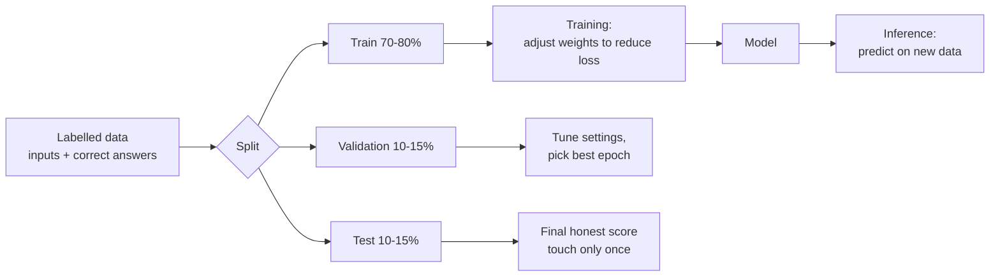
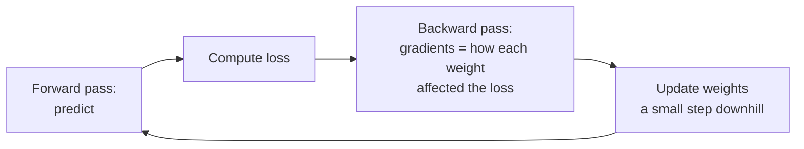

# Module 1A — ML/DL Refresher and Computer-Vision Primer [Crio]

> Basics · Week 4 · [Syllabus](../SYLLABUS.md#module-1a--mldl-refresher-and-computer-vision-primer-week-4-crio)

**Goal:** understand the machine learning underneath LLMs, and learn when a small classic model beats an LLM on
cost, speed and accuracy.

```bash
mkdir -p projects/01a-snapclassify && cd projects/01a-snapclassify
uv init && uv add torch torchvision scikit-learn matplotlib gradio ollama
```

## 1A.1 What machine learning is



| Term | Meaning |
|---|---|
| Feature | An input value (pixel, word, price) |
| Label | The correct answer for an example |
| Training | Adjusting weights to make predictions match labels |
| Loss | A number measuring how wrong the model is; training pushes it down |
| Inference | Using the trained model on new inputs |

An LLM is the same idea at huge scale: the "label" for each position is simply the next token.

## 1A.2 Bias vs variance

```python
import numpy as np
from sklearn.metrics import mean_squared_error
from sklearn.model_selection import train_test_split
from sklearn.pipeline import make_pipeline
from sklearn.preprocessing import PolynomialFeatures
from sklearn.linear_model import LinearRegression

rng = np.random.default_rng(0)
X = np.sort(rng.uniform(0, 1, 60)).reshape(-1, 1)
y = np.sin(2 * np.pi * X).ravel() + rng.normal(0, 0.2, 60)
Xtr, Xte, ytr, yte = train_test_split(X, y, test_size=0.3, random_state=0)

for degree in (1, 4, 15):
    model = make_pipeline(PolynomialFeatures(degree), LinearRegression()).fit(Xtr, ytr)
    print(f"degree {degree:2}: train error {mean_squared_error(ytr, model.predict(Xtr)):.3f}"
          f"  test error {mean_squared_error(yte, model.predict(Xte)):.3f}")
# degree 1  → both errors high          = underfitting (high bias)
# degree 4  → both low                  = good fit
# degree 15 → train tiny, test large    = overfitting (high variance)
```

| Symptom | Diagnosis | Fixes |
|---|---|---|
| Train and test both bad | Underfitting (bias) | Bigger model, better features, train longer |
| Train good, test bad | Overfitting (variance) | More data, regularisation, smaller model, early stopping, augmentation |

You will see exactly this in Module 7 when fine-tuning loss curves diverge.

## 1A.3 Metrics

```python
from sklearn.metrics import classification_report, confusion_matrix

y_true = ["spam", "spam", "ham", "ham", "ham", "spam", "ham", "ham"]
y_pred = ["spam", "ham",  "ham", "ham", "spam", "spam", "ham", "ham"]
print(confusion_matrix(y_true, y_pred, labels=["spam", "ham"]))
print(classification_report(y_true, y_pred))
```

| Metric | Question | Use when |
|---|---|---|
| Accuracy | % correct overall | Classes are balanced |
| Precision | Of items I flagged, how many were right? | False alarms are costly (blocking good emails) |
| Recall | Of real positives, how many did I catch? | Misses are costly (fraud, disease) |
| F1 | Balance of precision and recall | Imbalanced classes |

The same metrics return in RAG (precision@K, recall@k) and agent evals.

## 1A.4 Model families

| Family | Example | Strength |
|---|---|---|
| Linear / logistic regression | Price prediction, spam | Fast, explainable |
| Decision trees, gradient boosting (XGBoost) | Tabular business data | Best default for spreadsheets |
| CNNs | Image classification | Images, local patterns |
| RNN/LSTM | Older sequence models | Replaced by transformers |
| Transformers | LLMs, vision transformers | Language, multimodal, scale |

## 1A.5 Neural networks and backpropagation (intuition)

A neural network is layers of weighted sums followed by non-linear functions. **Training loop:**



```python
import torch
from torch import nn

model = nn.Sequential(nn.Linear(2, 16), nn.ReLU(), nn.Linear(16, 1))
opt = torch.optim.SGD(model.parameters(), lr=0.1)
X = torch.randn(200, 2)
y = (X[:, :1] * X[:, 1:] > 0).float()          # XOR-like pattern a straight line can't learn

for step in range(500):
    loss = nn.functional.binary_cross_entropy_with_logits(model(X), y)
    opt.zero_grad(); loss.backward(); opt.step()   # backprop + update
    if step % 100 == 0:
        print(step, round(loss.item(), 3))
```

## 1A.6 CNNs and transfer learning

Training an image model from scratch needs millions of images. **Transfer learning** takes a model pretrained on
ImageNet and retrains only the last layer for your classes. It needs a few hundred images and minutes on a CPU.

Data layout (any two or more classes, e.g. photos of ripe vs unripe mangoes, or receipts vs ID cards):

```text
data/
  train/ripe/*.jpg   train/unripe/*.jpg
  val/ripe/*.jpg     val/unripe/*.jpg
```

```python
# train.py
import torch
from torch import nn
from torchvision import datasets, models, transforms

tf = transforms.Compose([transforms.Resize((224, 224)), transforms.ToTensor(),
                         transforms.Normalize([0.485, 0.456, 0.406], [0.229, 0.224, 0.225])])
train = datasets.ImageFolder("data/train", tf)
val = datasets.ImageFolder("data/val", tf)
train_dl = torch.utils.data.DataLoader(train, batch_size=16, shuffle=True)
val_dl = torch.utils.data.DataLoader(val, batch_size=32)

model = models.resnet18(weights=models.ResNet18_Weights.DEFAULT)
for p in model.parameters():
    p.requires_grad = False                                    # freeze the pretrained body
model.fc = nn.Linear(model.fc.in_features, len(train.classes))  # new head for our classes
opt = torch.optim.Adam(model.fc.parameters(), lr=1e-3)

for epoch in range(5):
    model.train()
    for x, y in train_dl:
        loss = nn.functional.cross_entropy(model(x), y)
        opt.zero_grad(); loss.backward(); opt.step()
    model.eval()
    correct = sum((model(x).argmax(1) == y).sum().item() for x, y in val_dl)
    print(f"epoch {epoch}: val accuracy {correct / len(val):.2%}")

torch.save({"state": model.state_dict(), "classes": train.classes}, "snapclassify.pt")
```

### Deploy as a web app

```python
# app.py   run: uv run python app.py  → http://localhost:7860
import gradio as gr
import torch
from torch import nn
from torchvision import models, transforms

ckpt = torch.load("snapclassify.pt")
model = models.resnet18()
model.fc = nn.Linear(model.fc.in_features, len(ckpt["classes"]))
model.load_state_dict(ckpt["state"]); model.eval()
tf = transforms.Compose([transforms.Resize((224, 224)), transforms.ToTensor(),
                         transforms.Normalize([0.485, 0.456, 0.406], [0.229, 0.224, 0.225])])

def predict(img):
    with torch.no_grad():
        probs = model(tf(img).unsqueeze(0)).softmax(1)[0]
    return {c: float(p) for c, p in zip(ckpt["classes"], probs)}

gr.Interface(predict, gr.Image(type="pil"), gr.Label(num_top_classes=3), title="SnapClassify").launch()
```

## 1A.7 Classic model vs multimodal LLM

Ask a local vision LLM the same question and compare.

```bash
ollama pull gemma3:4b      # multimodal; or llava, qwen2.5vl
```

```python
# compare.py
import time, pathlib, ollama

def llm_classify(path: str, classes: list[str]) -> str:
    r = ollama.chat(model="gemma3:4b", options={"temperature": 0}, messages=[{
        "role": "user", "content": f"Classify this image as one of {classes}. Reply with the label only.",
        "images": [path]}])
    return r.message.content.strip().lower()

classes = ["ripe", "unripe"]
files = [(str(p), p.parent.name) for p in pathlib.Path("data/val").rglob("*.jpg")]
start, correct = time.perf_counter(), 0
for path, label in files:
    correct += llm_classify(path, classes) == label
print(f"LLM accuracy {correct/len(files):.2%}, {(time.perf_counter()-start)/len(files):.2f}s per image")
```

| | Fine-tuned ResNet18 | Multimodal LLM |
|---|---|---|
| Accuracy on your classes | Usually higher for narrow tasks | Good zero-shot, weaker on niche classes |
| Speed per image | ~10–50 ms on CPU | ~1–10 s |
| Cost at 1M images | Near zero | High (hosted) or slow (local) |
| Needs labelled data | Yes (a few hundred) | No |
| Handles new classes instantly | No | Yes (change the prompt) |

**Lesson:** use the LLM to prototype or label data; ship the small model when volume is high and classes are fixed.

## Build — SnapClassify

1. Collect 100+ images per class (your phone camera is fine), split train/val.
2. Transfer-learn ResNet18; plot val accuracy per epoch.
3. Deploy with Gradio.
4. Compare with a multimodal LLM on the same val set: accuracy, latency, cost.

## Checkpoint

- [ ] Val accuracy reported with a confusion matrix.
- [ ] Comparison table with your real numbers.
- [ ] You can explain overfitting, precision vs recall and transfer learning in your own words.

## Further reading

- fast.ai *Practical Deep Learning for Coders* (lessons 1–2)
- PyTorch *Transfer Learning for Computer Vision* tutorial
- Andrew Ng, *Machine Learning Specialization* (Coursera)
