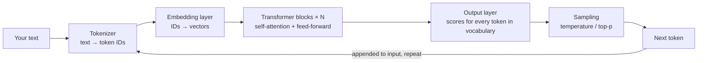
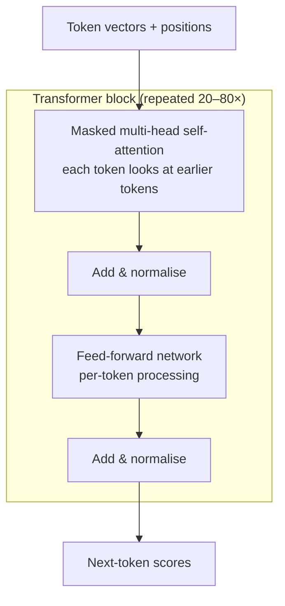

# Module 2 — LLM Architecture and Model Ecosystem

> Phase 2 · Weeks 4–5 · Level 1 Understand · [Syllabus](../SYLLABUS.md#module-2-llm-architecture-and-model-ecosystem)

**Goal:** understand what happens inside an LLM well enough to choose a model with numbers, not hype.

```bash
mkdir -p projects/02-model-benchmark && cd projects/02-model-benchmark
uv init && uv add ollama openai numpy tiktoken transformers
```

## The big picture



An LLM does **one thing**: given the tokens so far, predict a probability for every possible next token.
Chatting, coding and tool calling are all this loop repeated.

---

## 2.1 Math essentials (just enough)

### Vectors and similarity

A vector is a list of numbers. Meaning lives in the **direction** of the vector.

```python
import numpy as np

a = np.array([0.9, 0.1, 0.3])   # "cat"
b = np.array([0.8, 0.2, 0.35])  # "kitten"
c = np.array([0.1, 0.9, 0.0])   # "stock market"

def cosine(x, y):
    return float(x @ y / (np.linalg.norm(x) * np.linalg.norm(y)))

print(round(cosine(a, b), 3))  # close to 1 → similar
print(round(cosine(a, c), 3))  # close to 0 → unrelated
```

- **Dot product** `x @ y` — large when vectors point the same way.
- **Cosine similarity** — dot product divided by lengths; ignores size, keeps direction. Range −1…1.

### Softmax: scores → probabilities

The model outputs a raw score (a *logit*) per token. Softmax converts them to probabilities that sum to 1.

```python
import numpy as np

def softmax(logits, temperature=1.0):
    z = np.array(logits) / temperature
    z = z - z.max()                  # numerical stability
    e = np.exp(z)
    return e / e.sum()

logits = [4.0, 3.0, 1.0, 0.5]        # "Paris", "Lyon", "London", "banana"
for t in (0.2, 1.0, 2.0):
    print(t, np.round(softmax(logits, t), 3))
# low temperature  → almost all probability on "Paris" (deterministic)
# high temperature → flatter distribution (creative / random)
```

### Sampling: temperature and top-p

```python
import numpy as np

rng = np.random.default_rng(0)
tokens = ["Paris", "Lyon", "London", "banana"]

def sample(logits, temperature=1.0, top_p=1.0):
    probs = softmax(logits, temperature)
    order = np.argsort(probs)[::-1]
    cum = np.cumsum(probs[order])
    keep = order[: np.searchsorted(cum, top_p) + 1]    # smallest set covering top_p
    p = probs[keep] / probs[keep].sum()
    return tokens[rng.choice(keep, p=p)]

print([sample([4, 3, 1, 0.5], temperature=1.0, top_p=0.9) for _ in range(10)])
```

| Setting | Use |
|---|---|
| `temperature=0` | Extraction, classification, code, evals |
| `0.3–0.7` | General Q&A |
| `0.8–1.2` | Brainstorming, creative writing |
| `top_p=0.9` | Cuts off the long tail of unlikely tokens |

> **Exercise 2.1** — Ask a local model the same creative prompt 5 times at temperature 0 and 5 times at 1.0. Count distinct answers.

---

## 2.2 How text becomes numbers: tokens and embeddings

### Tokenization

Models don't read characters or words — they read **tokens** (sub-word pieces). ~1 token ≈ ¾ English word;
Hindi, Marathi and code often use more tokens per word.

```python
import tiktoken   # OpenAI's tokenizer; other models differ but the idea is identical

enc = tiktoken.get_encoding("cl100k_base")
for text in ["Hello world", "unbelievably", "नमस्ते दुनिया", "def add(a, b): return a + b"]:
    ids = enc.encode(text)
    print(f"{text!r}: {len(ids)} tokens → {[enc.decode([i]) for i in ids]}")
```

Tokenizer for an open model (downloads a small file from Hugging Face):

```python
from transformers import AutoTokenizer

tok = AutoTokenizer.from_pretrained("Qwen/Qwen2.5-0.5B-Instruct")
print(tok.tokenize("Retrieval-augmented generation"))
print(len(tok("Retrieval-augmented generation")["input_ids"]), "tokens")
```

Why you care: **pricing, context limits and speed are all counted in tokens.**

### Embeddings and positional encoding

Each token ID is looked up in an **embedding table** → a vector (e.g. 4096 numbers). Because attention by itself
ignores order, the model adds **position information** (modern models use RoPE — rotary position embeddings) so
"dog bites man" ≠ "man bites dog".

---

## 2.3 The Transformer



### Self-attention in 15 lines

Each token makes a **query** (what am I looking for?), a **key** (what do I contain?) and a **value** (what do I pass on?).
Attention = for each query, a weighted average of values, weighted by how well it matches each key.

```python
import numpy as np

rng = np.random.default_rng(42)
tokens = ["The", "cat", "sat"]
d = 4
X = rng.normal(size=(3, d))                        # token vectors
Wq, Wk, Wv = (rng.normal(size=(d, d)) for _ in range(3))
Q, K, V = X @ Wq, X @ Wk, X @ Wv

scores = Q @ K.T / np.sqrt(d)                      # how much each token attends to each other
mask = np.triu(np.ones((3, 3)), k=1) * -1e9        # causal mask: no looking at future tokens
weights = np.apply_along_axis(lambda r: np.exp(r - r.max()) / np.exp(r - r.max()).sum(), 1, scores + mask)
output = weights @ V

print(np.round(weights, 2))   # row i = how token i distributes attention over tokens 0..i
```

- **Multi-head** — run several attentions in parallel so different heads learn different relations (grammar, coreference, facts).
- **Decoder-only** — GPT, Llama, Claude, Qwen: the causal mask means each token sees only the past, which is exactly what next-token prediction needs.

> **Exercise 2.3** — Watch "Attention in transformers, visually explained" (3Blue1Brown) and then explain the attention matrix above in your own words.

---

## 2.4 Context windows

The context window = max tokens of **prompt + answer** the model handles at once (8K … 1M+).

| Concern | What happens |
|---|---|
| Overflow | Oldest tokens are cut or the request fails |
| Cost | Hosted APIs bill every input token on every call |
| Speed | Attention cost grows with length; long prompts = slower first token |
| "Lost in the middle" | Models recall start and end of a long prompt better than the middle |

Ollama's default context is small — raise it when you send documents:

```python
import ollama

r = ollama.chat(model="llama3.2:3b",
                messages=[{"role": "user", "content": open("long.txt").read() + "\n\nSummarise."}],
                options={"num_ctx": 16384})
print(r.prompt_eval_count, "prompt tokens")
```

This is exactly why RAG exists: send the **relevant 2K tokens**, not the whole 500-page manual.

---

## 2.5 The model ecosystem

| Family | Maker | Open weights? | Notes |
|---|---|---|---|
| GPT | OpenAI | Mostly no (gpt-oss yes) | Strong all-rounder, huge tooling |
| Claude | Anthropic | No | Strong reasoning, coding, long context, tool use |
| Gemini | Google | No (Gemma is open) | Multimodal, very long context |
| Llama | Meta | Yes | Most popular open family |
| Mistral | Mistral AI | Mostly yes | Efficient European models |
| Qwen | Alibaba | Yes | Excellent small/medium open models, multilingual |
| Phi | Microsoft | Yes | Small models, good reasoning per size |

**Open vs proprietary**

| | Open weights (via Ollama/HF) | Proprietary API |
|---|---|---|
| Cost | Your hardware | Per token |
| Privacy | Data never leaves you | Sent to provider |
| Quality ceiling | Lower (improving fast) | Highest |
| Control | Fine-tune, inspect, self-host | Limited |
| Ops burden | You run it | None |

Always check the **licence** (`ollama show <model>` → License) before commercial use.

---

## 2.6 Reasoning models and small language models

- **Reasoning ("thinking") models** generate hidden or visible reasoning tokens before answering. Better at maths,
  multi-step logic, planning; slower and costlier. Ollama exposes this with `think=True` on supporting models.
- **Small language models (SLMs, 1–4B)** — fast, cheap, run on laptops/phones; great for classification,
  extraction, routing, and as fine-tuning bases (Module 7).

```python
import ollama

r = ollama.chat(model="qwen3:4b", messages=[{"role": "user", "content": "Is 391 prime?"}], think=True)
print("THINKING:", r.message.thinking[:300] if r.message.thinking else None)
print("ANSWER:", r.message.content)
```

Rule of thumb: **start with the smallest model that passes your eval**, not the biggest one available.

---

## 2.7 Structured outputs and streaming

Covered hands-on in Module 1 (Pydantic + `format=schema`) and Module 0 (streaming). The OpenAI-compatible form:

```python
from openai import OpenAI
from pydantic import BaseModel

class City(BaseModel):
    name: str
    country: str
    population_millions: float

client = OpenAI(base_url="http://localhost:11434/v1", api_key="ollama")
resp = client.beta.chat.completions.parse(
    model="qwen2.5:7b",
    messages=[{"role": "user", "content": "Give facts about Mumbai."}],
    response_format=City,
)
print(resp.choices[0].message.parsed)
```

---

## 2.8 Cost, latency, quality trade-offs

Measure three latencies:

- **TTFT** (time to first token) — what users feel.
- **Tokens/second** — reading speed of the stream.
- **Total latency** — TTFT + output tokens ÷ speed.

**Cost** (hosted) = input tokens × input price + output tokens × output price. Output tokens usually cost 3–5× more.

## Hands-on demo — model benchmark script

```python
# benchmark.py   run: uv run python benchmark.py
import csv
import time

import ollama

MODELS = ["llama3.2:3b", "qwen2.5:7b", "phi4-mini"]
TASKS = {
    "fact": "What is the capital of Australia? Answer in one word.",
    "reasoning": "A bat and ball cost 1.10 in total. The bat costs 1.00 more than the ball. What does the ball cost?",
    "code": "Write a Python function is_palindrome(s) in under 6 lines.",
}
# price per 1M tokens (input, output) — 0 for local; fill in when you add hosted providers
PRICES = {m: (0.0, 0.0) for m in MODELS}

rows = []
for model in MODELS:
    for name, prompt in TASKS.items():
        start = time.perf_counter()
        ttft, text, final = None, "", None
        for chunk in ollama.chat(model=model, messages=[{"role": "user", "content": prompt}],
                                 stream=True, options={"temperature": 0}):
            if ttft is None and chunk.message.content:
                ttft = time.perf_counter() - start
            text += chunk.message.content
            if chunk.done:
                final = chunk
        total = time.perf_counter() - start
        tps = final.eval_count / (final.eval_duration / 1e9)
        pin, pout = PRICES[model]
        cost = (final.prompt_eval_count * pin + final.eval_count * pout) / 1e6
        rows.append({"model": model, "task": name, "ttft_s": round(ttft, 2), "total_s": round(total, 2),
                     "tok_per_s": round(tps, 1), "out_tokens": final.eval_count, "cost_usd": cost,
                     "answer": text.strip().replace("\n", " ")[:80]})
        print(rows[-1])

with open("results.csv", "w", newline="") as f:
    w = csv.DictWriter(f, fieldnames=rows[0].keys())
    w.writeheader(); w.writerows(rows)
```

First run on a model includes **load time** — run twice and use the second result.

## Checkpoint

- [ ] `results.csv` compares at least 3 local models on 3 tasks.
- [ ] You can explain tokens, attention, context window and temperature without notes.
- [ ] You wrote a one-paragraph model choice for "an FAQ chatbot on a 16 GB laptop", backed by your numbers.

## Key terms

| Term | Meaning |
|---|---|
| Logit | Raw score for a candidate next token |
| Softmax | Turns logits into probabilities |
| Attention | Mechanism letting each token weigh other tokens |
| Decoder-only | Architecture that predicts the next token from past tokens only |
| TTFT | Time to first token |
| SLM | Small language model (~1–4B parameters) |

## Further reading

- 3Blue1Brown, *Neural networks* series (chapters on transformers and attention)
- Jay Alammar, *The Illustrated Transformer*
- Andrej Karpathy, *Let's build GPT from scratch* (video)
