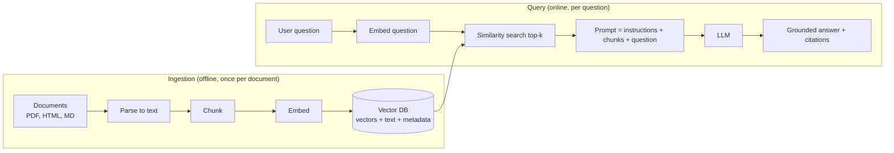
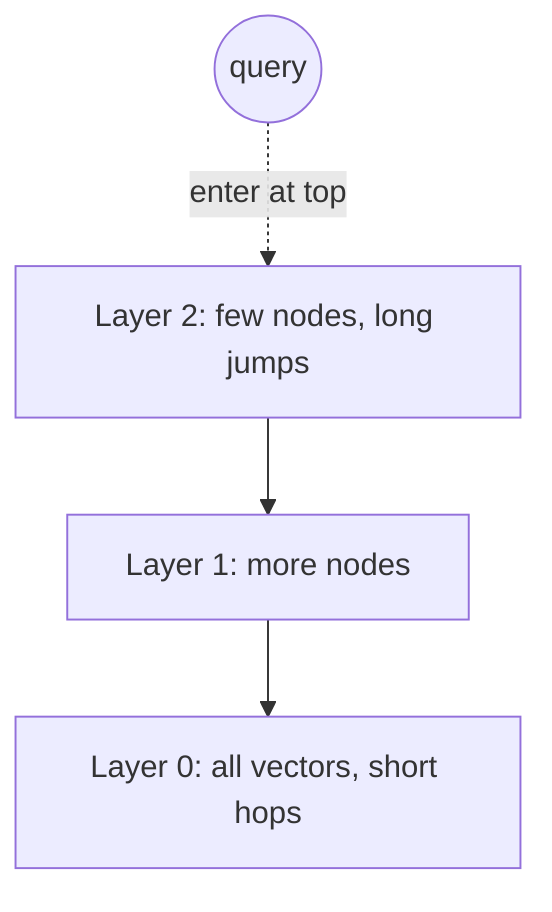
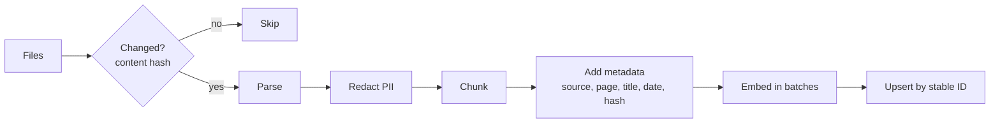

# Module 4 — Retrieval Architecture and Vector Infrastructure

> Phase 3 · Weeks 7–9 · Level 2 Build · [Syllabus](../SYLLABUS.md#module-4-retrieval-architecture-and-vector-infrastructure)

**Goal:** turn a folder of documents into a system that finds the right passage and answers from it.

```bash
mkdir -p projects/04-mini-rag && cd projects/04-mini-rag
uv init && uv add ollama chromadb qdrant-client faiss-cpu numpy pymupdf pydantic rank-bm25
```

---

## 4.1 Why RAG?

LLMs don't know your private documents, and their knowledge stops at a training cut-off. **Retrieval-Augmented
Generation** fetches relevant text at question time and puts it in the prompt.



| Approach | Good for | Weak at |
|---|---|---|
| Prompting only | General knowledge, formatting | Private/fresh facts |
| **RAG** | Private, changing, citable knowledge | Changing model style/behaviour |
| Fine-tuning | Style, format, narrow skills | Adding facts that change often |

---

## 4.2 Embedding models

| Model | Where | Dims | Notes |
|---|---|---|---|
| `nomic-embed-text` | Ollama (local) | 768 | Good default, free |
| `mxbai-embed-large` | Ollama (local) | 1024 | Stronger, bigger |
| `BAAI/bge-small-en-v1.5` | Hugging Face | 384 | Fast, popular |
| `bge-m3` | Ollama / HF | 1024 | Multilingual (Hindi, Marathi…) |
| `text-embedding-3-small` | OpenAI API | 1536 | Hosted, cheap |

Rules: **use the same model for documents and queries**; re-embed everything if you switch models; check the
model's documented prefixes (nomic uses `search_document:` / `search_query:`).

```python
import numpy as np, ollama

def embed(texts: list[str], kind: str = "document") -> np.ndarray:
    prefix = "search_document: " if kind == "document" else "search_query: "
    vecs = ollama.embed(model="nomic-embed-text", input=[prefix + t for t in texts]).embeddings
    v = np.array(vecs, dtype="float32")
    return v / np.linalg.norm(v, axis=1, keepdims=True)   # normalise → dot product = cosine

docs = ["UPI refunds take 3-5 working days.", "Reset your password from Settings > Security.",
        "Our Pune office is open 9am to 6pm."]
D = embed(docs)
q = embed(["how long for a refund?"], kind="query")[0]
scores = D @ q
for i in np.argsort(-scores):
    print(round(float(scores[i]), 3), docs[i])
```

This 15-line script **is** semantic search. Everything else in this module is making it scale and work on real documents.

---

## 4.3 Document parsing

Garbage in → garbage retrieved. Parsing is often the biggest quality lever.

```python
import fitz  # PyMuPDF

def pdf_to_pages(path: str) -> list[dict]:
    doc = fitz.open(path)
    return [{"text": page.get_text("text"), "page": i + 1, "source": path} for i, page in enumerate(doc)]
```

| Content | Tool |
|---|---|
| Digital PDFs | PyMuPDF (fast), pdfplumber (tables) |
| Complex layouts, tables | Docling, Unstructured |
| Scanned PDFs / images | OCR: Tesseract, Docling OCR |
| HTML | BeautifulSoup / trafilatura (strip nav, ads) |
| Word / PowerPoint | python-docx, python-pptx, Docling |

Keep **page numbers and source** — you need them for citations.

---

## 4.4 Chunking strategies

Embedding a whole 50-page document gives one blurry vector. Split it into **chunks** that each hold one idea.

```python
def fixed_chunks(text: str, size: int = 800, overlap: int = 100) -> list[str]:
    chunks, start = [], 0
    while start < len(text):
        chunks.append(text[start:start + size])
        start += size - overlap
    return chunks


def recursive_chunks(text: str, size: int = 800, seps=("\n\n", "\n", ". ", " ")) -> list[str]:
    """Split on the largest natural boundary that keeps chunks under `size`."""
    if len(text) <= size:
        return [text]
    for sep in seps:
        parts = text.split(sep)
        if len(parts) > 1:
            out, cur = [], ""
            for p in parts:
                if len(cur) + len(p) + len(sep) <= size:
                    cur = f"{cur}{sep}{p}" if cur else p
                else:
                    if cur:
                        out.append(cur)
                    cur = p
            if cur:
                out.append(cur)
            return [c for piece in out for c in recursive_chunks(piece, size, seps)]
    return fixed_chunks(text, size, 0)
```

| Strategy | How | Pros / cons |
|---|---|---|
| Fixed-size | Every N chars/tokens | Simple; cuts mid-sentence |
| Recursive | Paragraph → line → sentence | Good default |
| Structure-aware | Split on headings (Markdown/HTML) | Keeps sections intact |
| Semantic | Split where embedding similarity drops | Coherent chunks; slower |

Start with **~500–1000 characters, 10–15% overlap**, then tune with your eval (Module 5).

---

## 4.5 Vector databases

A vector DB stores vectors + text + metadata and finds nearest neighbours fast.

| DB | Type | Use |
|---|---|---|
| FAISS | Library (in-process) | Learning, fast local search |
| Chroma | Embedded DB | Prototypes, simple persistence |
| Qdrant | Server (Docker) or embedded | Production: filters, hybrid, scale |

### Indexing: why not compare against every vector?

Brute force = compare with all N vectors — fine for 100K, too slow for 100M. **Approximate nearest neighbour (ANN)** indexes:

- **HNSW** — a layered graph; search hops from coarse to fine layers. Fast, accurate, memory-heavy. Default in Qdrant/Chroma.
- **IVF** — cluster vectors; search only the nearest clusters. Less memory; tune `nprobe` for accuracy.



### FAISS

```python
import faiss
index = faiss.IndexFlatIP(D.shape[1])      # exact inner product (vectors normalised)
index.add(D)
scores, ids = index.search(q.reshape(1, -1), k=2)
print([docs[i] for i in ids[0]])
```

### Chroma

```python
import chromadb
client = chromadb.PersistentClient(path="./chroma")
col = client.get_or_create_collection("kb", metadata={"hnsw:space": "cosine"})
col.upsert(ids=["d1", "d2", "d3"], documents=docs, embeddings=D.tolist(),
           metadatas=[{"source": "faq.pdf", "page": 1}, {"source": "faq.pdf", "page": 2}, {"source": "contact.md", "page": 1}])
res = col.query(query_embeddings=[q.tolist()], n_results=2, where={"source": "faq.pdf"})
print(res["documents"])
```

### Qdrant

```bash
docker run -p 6333:6333 -v $(pwd)/qdrant_data:/qdrant/storage qdrant/qdrant
```

```python
from qdrant_client import QdrantClient
from qdrant_client.models import Distance, PointStruct, VectorParams, Filter, FieldCondition, MatchValue

qc = QdrantClient(url="http://localhost:6333")      # or QdrantClient(path="./qdrant_local") without Docker
qc.recreate_collection("kb", vectors_config=VectorParams(size=D.shape[1], distance=Distance.COSINE))
qc.upsert("kb", points=[PointStruct(id=i, vector=D[i].tolist(), payload={"text": docs[i], "source": "faq"})
                        for i in range(len(docs))])
hits = qc.query_points("kb", query=q.tolist(), limit=2,
                       query_filter=Filter(must=[FieldCondition(key="source", match=MatchValue(value="faq"))])).points
print([(h.score, h.payload["text"]) for h in hits])
```

---

## 4.6 Ingestion pipelines and metadata



- **Stable IDs** (`hash(source + chunk_index)`) → re-running ingestion updates rather than duplicates.
- **Metadata** enables filters ("only 2025 policies", "only HR docs") and citations.
- **Content hash** → skip unchanged files.

---

## 4.7 Hybrid retrieval basics

Vectors capture meaning but miss exact terms (error codes, product IDs, names). Keyword search (BM25) catches those.

```python
from rank_bm25 import BM25Okapi
bm25 = BM25Okapi([d.lower().split() for d in docs])
print(bm25.get_scores("password reset".split()))
```

Combine both result lists (Module 5 covers reciprocal rank fusion).

---

## 4.8 Knowledge lifecycle and PII

- **Update:** re-ingest changed files (hash check); **delete:** remove all chunks whose `source` was deleted.
- **PII:** redact before embedding — once in the vector DB and LLM logs, it is hard to remove (DPDP, Module 11).

```python
import re
PII = {
    "EMAIL": r"[\w.+-]+@[\w-]+\.[\w.]+",
    "PHONE_IN": r"(?:\+91[\s-]?)?[6-9]\d{9}",
    "PAN": r"[A-Z]{5}\d{4}[A-Z]",
    "AADHAAR": r"\b\d{4}\s?\d{4}\s?\d{4}\b",
}
def redact(text: str) -> str:
    for label, pattern in PII.items():
        text = re.sub(pattern, f"[{label}]", text)
    return text

print(redact("Call 9876543210 or mail a.b@x.com, PAN ABCDE1234F"))
```

For production use Microsoft **Presidio** (NER-based, extensible).

---

## 4.9 Frameworks: LangChain and LlamaIndex

You just built RAG in plain Python — now you know what frameworks hide. LlamaIndex in a few lines:

```python
# uv add llama-index llama-index-llms-ollama llama-index-embeddings-ollama
from llama_index.core import Settings, SimpleDirectoryReader, VectorStoreIndex
from llama_index.embeddings.ollama import OllamaEmbedding
from llama_index.llms.ollama import Ollama

Settings.llm = Ollama(model="llama3.2:3b", request_timeout=120)
Settings.embed_model = OllamaEmbedding(model_name="nomic-embed-text")
index = VectorStoreIndex.from_documents(SimpleDirectoryReader("data").load_data())
print(index.as_query_engine(similarity_top_k=3).query("What is the refund policy?"))
```

Use frameworks for speed and integrations; drop to plain Python when you need control or debugging clarity.

---

## Hands-on — Project 2: Mini-RAG

```python
# mini_rag.py   usage: uv run python mini_rag.py ingest data/   |   uv run python mini_rag.py ask "question"
import hashlib, sys
from pathlib import Path

import chromadb, fitz, ollama

EMBED, LLM = "nomic-embed-text", "llama3.2:3b"
col = chromadb.PersistentClient(path="./chroma").get_or_create_collection("kb", metadata={"hnsw:space": "cosine"})


def load(path: Path) -> list[tuple[str, dict]]:
    if path.suffix == ".pdf":
        return [(p.get_text(), {"source": path.name, "page": i + 1}) for i, p in enumerate(fitz.open(path))]
    return [(path.read_text(encoding="utf-8"), {"source": path.name, "page": 1})]


def ingest(folder: str) -> None:
    for path in Path(folder).rglob("*"):
        if path.suffix not in {".pdf", ".md", ".txt"}:
            continue
        for text, meta in load(path):
            chunks = recursive_chunks(redact(text), size=800)        # from 4.4 and 4.8
            if not chunks:
                continue
            ids = [hashlib.sha1(f"{meta['source']}:{meta['page']}:{i}".encode()).hexdigest() for i in range(len(chunks))]
            vecs = ollama.embed(model=EMBED, input=[f"search_document: {c}" for c in chunks]).embeddings
            col.upsert(ids=ids, documents=chunks, embeddings=vecs, metadatas=[meta] * len(chunks))
        print("ingested", path.name)


def ask(question: str, k: int = 4) -> str:
    qv = ollama.embed(model=EMBED, input=[f"search_query: {question}"]).embeddings[0]
    res = col.query(query_embeddings=[qv], n_results=k)
    context = "\n\n".join(f"[{m['source']} p{m['page']}]\n{d}" for d, m in zip(res["documents"][0], res["metadatas"][0]))
    prompt = (f"Answer using only the context. Cite sources like [file pN]. "
              f"If the answer is not in the context, say \"I don't know\".\n\n<context>\n{context}\n</context>\n\n"
              f"Question: {question}")
    return ollama.chat(model=LLM, messages=[{"role": "user", "content": prompt}], options={"temperature": 0}).message.content


if __name__ == "__main__":
    cmd, arg = sys.argv[1], sys.argv[2]
    ingest(arg) if cmd == "ingest" else print(ask(arg))
```

## Checkpoint

- [ ] Ingest a corpus you care about (≥ 20 pages); re-running ingest creates no duplicates.
- [ ] `ask` returns grounded answers with `[source pN]` citations and says "I don't know" for off-topic questions.
- [ ] Tried two chunk sizes and noted which answered your 10 test questions better.
- [ ] You can draw the ingestion and query pipelines from memory.

## Key terms

| Term | Meaning |
|---|---|
| Chunk | A passage of a document embedded as one vector |
| Top-k | Number of nearest chunks retrieved |
| ANN | Approximate nearest neighbour search |
| HNSW / IVF | Graph-based / cluster-based ANN indexes |
| Upsert | Insert or update by ID |
| PII | Personally identifiable information |
