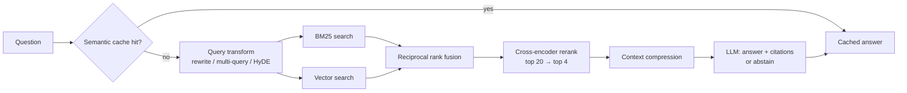
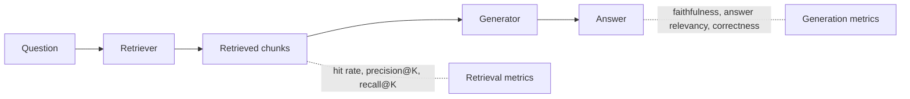
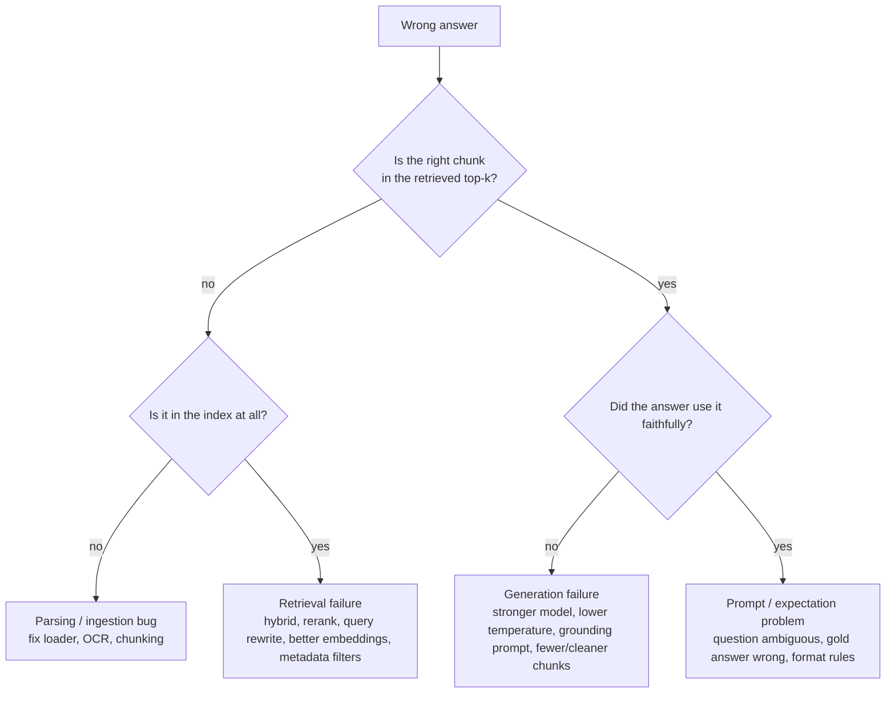

# Module 5 — Production RAG and Retrieval Optimisation

> Phase 3 · Weeks 10–12 · Level 2 Build · [Syllabus](../SYLLABUS.md#module-5-production-rag-and-retrieval-optimisation)

**Goal:** when your RAG gives a wrong answer, know exactly why — and fix it with measured improvements.

```bash
cd projects/04-mini-rag   # we extend Mini-RAG
uv add rank-bm25 sentence-transformers ragas
```

## Advanced RAG pipeline



Improve one box at a time and **measure after each change**.

---

## 5.1 Sparse vs dense retrieval and fusion

| | Sparse (BM25) | Dense (embeddings) |
|---|---|---|
| Matches | Exact words | Meaning |
| Wins on | IDs, codes, names, rare terms | Paraphrases, synonyms |
| Fails on | "refund" vs "money back" | "error E-4012" |

**Reciprocal Rank Fusion (RRF)** merges ranked lists without needing comparable scores:

```python
from collections import defaultdict

def rrf(*rankings: list[str], k: int = 60) -> list[str]:
    score = defaultdict(float)
    for ranking in rankings:
        for rank, doc_id in enumerate(ranking):
            score[doc_id] += 1 / (k + rank + 1)
    return sorted(score, key=score.get, reverse=True)

print(rrf(["a", "b", "c"], ["c", "a", "d"]))   # ['a', 'c', 'b', 'd']
```

```python
from rank_bm25 import BM25Okapi

class HybridRetriever:
    def __init__(self, ids, texts, embed_fn):
        self.ids, self.texts, self.embed = ids, texts, embed_fn
        self.bm25 = BM25Okapi([t.lower().split() for t in texts])
        self.vecs = embed_fn(texts, kind="document")

    def search(self, query: str, k: int = 20) -> list[str]:
        bm = self.bm25.get_scores(query.lower().split())
        sparse = [self.ids[i] for i in bm.argsort()[::-1][:k]]
        dense_scores = self.vecs @ self.embed([query], kind="query")[0]
        dense = [self.ids[i] for i in dense_scores.argsort()[::-1][:k]]
        return rrf(sparse, dense)[:k]
```

---

## 5.2 Reranking with a cross-encoder

Retrieval embeds query and chunk **separately** (fast, approximate). A **cross-encoder** reads query + chunk
**together** and scores relevance precisely — too slow for millions, perfect for the top 20.

```python
from sentence_transformers import CrossEncoder

reranker = CrossEncoder("BAAI/bge-reranker-base")   # or "cross-encoder/ms-marco-MiniLM-L-6-v2" (smaller)

def rerank(query: str, candidates: list[str], top_n: int = 4) -> list[tuple[float, str]]:
    scores = reranker.predict([(query, c) for c in candidates])
    return sorted(zip(scores.tolist(), candidates), reverse=True)[:top_n]
```

Pattern: **retrieve 20–50 → rerank → keep 3–5.** Often the single biggest quality gain.

---

## 5.3 Query transformation

Users write vague or conversational questions. Fix the query before searching.

```python
import json, ollama

def llm(prompt, model="llama3.2:3b"):
    return ollama.chat(model=model, messages=[{"role": "user", "content": prompt}], options={"temperature": 0}).message.content

def rewrite(question: str, history: str = "") -> str:
    return llm(f"Rewrite the question as a standalone search query. Conversation:\n{history}\n"
               f"Question: {question}\nReturn only the query.")

def multi_query(question: str, n: int = 3) -> list[str]:
    out = llm(f"Write {n} different search queries that would help answer: {question}\n"
              f"Return a JSON list of strings only.")
    try:
        return json.loads(out)
    except json.JSONDecodeError:
        return [question]

def hyde(question: str) -> str:
    """Hypothetical Document Embeddings: embed a fake answer, which looks more like real documents."""
    return llm(f"Write a short factual paragraph that answers: {question}")
```

| Technique | Fixes |
|---|---|
| Rewrite | Follow-ups ("what about for NRIs?") that lack context |
| Multi-query | One phrasing misses relevant docs; fuse results with RRF |
| HyDE | Short questions whose embedding is far from long document chunks |

---

## 5.4 Efficiency: semantic caching and context compression

**Semantic cache** — reuse an answer when a new question means the same as a previous one.

```python
import numpy as np

class SemanticCache:
    def __init__(self, embed_fn, threshold: float = 0.92):
        self.embed, self.threshold, self.keys, self.values = embed_fn, threshold, [], []

    def get(self, q: str):
        if not self.keys:
            return None
        v = self.embed([q], kind="query")[0]
        sims = np.array(self.keys) @ v
        i = int(sims.argmax())
        return self.values[i] if sims[i] >= self.threshold else None

    def put(self, q: str, answer: str):
        self.keys.append(self.embed([q], kind="query")[0]); self.values.append(answer)
```

Too low a threshold returns wrong cached answers — tune it on real paraphrase pairs. Invalidate on re-ingest.

**Context compression** — send only the relevant sentences of each chunk (LLM extraction or sentence-level
similarity filtering) → fewer tokens, less "lost in the middle".

---

## 5.5 Measuring RAG

Evaluate retrieval and generation **separately**.



### Retrieval metrics (no LLM needed)

Build a small set of `{question, relevant_chunk_ids}`.

```python
def hit_rate(results: list[list[str]], gold: list[set[str]], k: int) -> float:
    return sum(bool(set(r[:k]) & g) for r, g in zip(results, gold)) / len(gold)

def precision_at_k(results, gold, k):
    return sum(len(set(r[:k]) & g) / k for r, g in zip(results, gold)) / len(gold)

def mrr(results, gold):
    total = 0.0
    for r, g in zip(results, gold):
        total += next((1 / (i + 1) for i, d in enumerate(r) if d in g), 0.0)
    return total / len(gold)
```

### Generation metrics (LLM judge) — RAGAS

| Metric | Question it answers |
|---|---|
| Faithfulness / groundedness | Is every claim supported by the retrieved context? |
| Answer relevancy | Does the answer address the question? |
| Context precision | Are the retrieved chunks relevant? |
| Context recall | Did retrieval find everything needed? |

```python
from ragas import EvaluationDataset, evaluate
from ragas.llms import LangchainLLMWrapper
from ragas.metrics import Faithfulness, LLMContextPrecisionWithReference
from langchain_ollama import ChatOllama   # uv add langchain-ollama

judge = LangchainLLMWrapper(ChatOllama(model="qwen2.5:7b", temperature=0))
data = EvaluationDataset.from_list([{
    "user_input": "How long do UPI refunds take?",
    "retrieved_contexts": ["UPI refunds take 3-5 working days."],
    "response": "UPI refunds take 3 to 5 working days.",
    "reference": "3-5 working days",
}])
print(evaluate(data, metrics=[Faithfulness(), LLMContextPrecisionWithReference()], llm=judge))
```

(RAGAS's API changes between versions — check its docs if an import fails. TruLens and DeepEval offer the same "RAG triad".)

---

## 5.6 Debugging RAG: failure taxonomy



Always log for each question: the query sent, retrieved chunk IDs + scores, final prompt, answer. You cannot
debug what you did not log.

---

## 5.7 Advanced patterns (overview)

| Pattern | Idea | Use when |
|---|---|---|
| Parent–child (small-to-big) | Search small chunks, send their larger parent section | Precise match but answer needs surrounding text |
| Contextual retrieval | Prepend a 1-line LLM summary of the document to each chunk before embedding | Chunks are ambiguous out of context ("it increased 5%") |
| Agentic RAG | An agent decides whether/what/how many times to retrieve (Module 8) | Multi-hop questions |
| GraphRAG | Build an entity–relation graph; retrieve by relationships | "How are X and Y connected?" across many docs |
| Multimodal RAG | Embed images/tables (vision models, table-to-text) | Diagrams, scanned forms, charts |
| Long context vs RAG | Just send the whole document | Few, small docs; cost/latency acceptable |

---

## Hands-on — Project 3: Grounded Q&A

Extend Mini-RAG:

1. `HybridRetriever` (BM25 + vector, RRF) → top 20.
2. Cross-encoder rerank → top 4.
3. Prompt requiring `[n]` citations and exact abstention text.
4. Post-check: if the answer has no citation or top rerank score < threshold → return `I don't know`.
5. `eval.py` computing hit rate@4, precision@4 and MRR for **baseline vs hybrid vs hybrid+rerank**.

```python
def answer(question: str) -> dict:
    ids = retriever.search(rewrite(question), k=20)
    ranked = rerank(question, [chunks[i] for i in ids], top_n=4)
    if not ranked or ranked[0][0] < 0.2:                     # tune on your data
        return {"answer": "I don't know.", "sources": []}
    context = "\n\n".join(f"[{n+1}] {text}" for n, (_, text) in enumerate(ranked))
    reply = llm(f"{GROUNDED_SYSTEM}\n<context>\n{context}\n</context>\nQuestion: {question}")
    return {"answer": reply, "sources": [text[:80] for _, text in ranked]}
```

| Config | Hit@4 | P@4 | MRR |
|---|---|---|---|
| Vector only | | | |
| + BM25 (hybrid) | | | |
| + rerank | | | |

## Checkpoint

- [ ] Quality report table filled with real numbers on ≥ 25 questions.
- [ ] Answers carry citations; off-topic questions abstain.
- [ ] You classified 5 failures using the taxonomy and fixed at least 2.

## Key terms

| Term | Meaning |
|---|---|
| BM25 | Classic keyword-ranking algorithm |
| RRF | Merges rankings by summing 1/(k+rank) |
| Cross-encoder | Model that scores a (query, passage) pair jointly |
| HyDE | Search with the embedding of a hypothetical answer |
| Faithfulness | Answer claims are supported by retrieved context |
| MRR | Mean reciprocal rank of the first relevant result |
