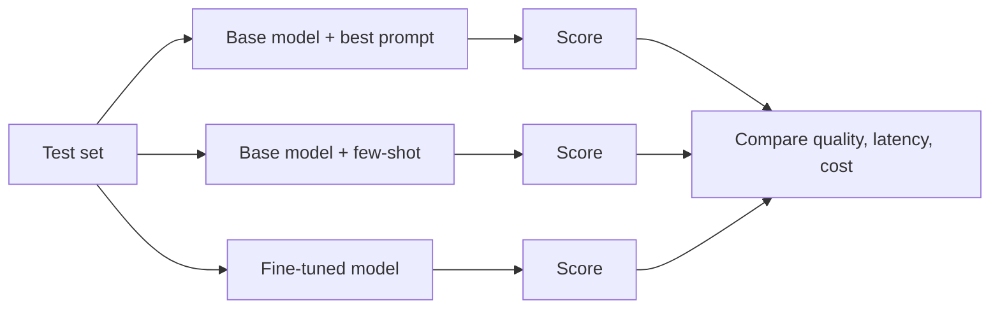

# Module 6 — Fine-Tuning Strategy and Adaptation Frameworks

> Phase 4 · Week 13 · Level 3 Adapt and Act · [Syllabus](../SYLLABUS.md#module-6-fine-tuning-strategy-and-adaptation-frameworks)

**Goal:** answer "should we fine-tune this?" with a framework and a baseline, not a gut feeling.

## 6.1 Prompting vs RAG vs fine-tuning

```mermaid
flowchart TD
    S[Problem] --> K{Does the model lack<br/>KNOWLEDGE (facts, docs)?}
    K -- yes --> R[RAG<br/>facts change, need citations]
    K -- no --> B{Does it lack a BEHAVIOUR<br/>(format, style, narrow skill)?}
    B -- no --> P[Better prompting + evals]
    B -- yes --> T{Fixed by few-shot prompting<br/>at acceptable cost/latency?}
    T -- yes --> P
    T -- no --> F{≥ several hundred good<br/>examples available?}
    F -- no --> D[Collect / synthesise data first]
    F -- yes --> FT[Fine-tune a small model<br/>LoRA / QLoRA]
```

| Need | Best tool | Example |
|---|---|---|
| Up-to-date or private facts | RAG | Company policies, product docs |
| Output format / tone | Prompt → fine-tune if prompts get huge | Always emit a specific JSON |
| Narrow task at low cost/latency | Fine-tune a small model | Classify 1M tickets/day on a 3B model |
| Domain jargon understanding | Fine-tune (sometimes continued pre-training) | Legal, medical shorthand |
| New facts that change weekly | **Not** fine-tuning | — |

Fine-tuning and RAG combine: a fine-tuned model that is better at *using* retrieved context.

---

## 6.2 Datasets

Quality beats quantity: **500 clean examples > 10,000 noisy ones.**

### Instruction format (chat/"messages" JSONL)

```jsonl
{"messages": [{"role": "system", "content": "Extract invoice fields as JSON."}, {"role": "user", "content": "Invoice #123 from Acme Ltd dated 3 Mar 2026, total ₹4,500"}, {"role": "assistant", "content": "{\"invoice_no\": \"123\", \"vendor\": \"Acme Ltd\", \"date\": \"2026-03-03\", \"total\": 4500}"}]}
```

### Curation checklist

- [ ] Representative of real inputs (lengths, languages, messiness)
- [ ] Correct outputs (human-checked sample)
- [ ] Deduplicated; no test examples leaked into training
- [ ] Balanced across classes/cases
- [ ] PII removed
- [ ] Split: train / validation / test (e.g. 80/10/10)

### Synthetic data generation

Use a strong model (teacher) to create examples for a small model (student) — then **filter**.

```python
import json, ollama
from pydantic import BaseModel

class Example(BaseModel):
    user: str
    assistant: str

SEED_TOPICS = ["late delivery", "wrong item", "refund status", "damaged product"]

def synth(topic: str, n: int = 5, model: str = "qwen2.5:7b") -> list[Example]:
    out = []
    for _ in range(n):
        r = ollama.chat(model=model, format=Example.model_json_schema(), options={"temperature": 0.9},
                        messages=[{"role": "user", "content":
                          f"Write one realistic customer message about '{topic}' (user) and an ideal polite, "
                          f"concise support reply under 60 words (assistant). JSON only."}])
        out.append(Example.model_validate_json(r.message.content))
    return out

with open("train.jsonl", "w") as f:
    for t in SEED_TOPICS:
        for ex in synth(t):
            f.write(json.dumps({"messages": [{"role": "user", "content": ex.user},
                                             {"role": "assistant", "content": ex.assistant}]}) + "\n")
```

Filter synthetic data with rules (length, format) and an LLM judge; review a random 5% by hand.
Check the teacher model's licence permits training on its outputs.

---

## 6.3 Baselines first



Never fine-tune without a baseline number — otherwise you can't tell if it helped.

## 6.4 Cost, performance and risk

| Factor | Fine-tuning implication |
|---|---|
| Upfront cost | Data creation (biggest), GPU hours (small with QLoRA) |
| Run cost | Small tuned model can be 10–50× cheaper than a large API model |
| Maintenance | Retrain when the base model or task changes |
| Risks | Catastrophic forgetting, overfitting, baking in bad data, licence limits |

**When fine-tuning is the wrong choice:** facts change often; < 200 examples; prompting already hits target;
you need citations; no one owns the retraining.

## Deliverable — decision log

```markdown
## Decision: fine-tune for <task>?
- Baseline (prompt only): 71% exact match, 1.2 s, ₹0.40 / 1K requests
- Few-shot: 78%, 1.6 s
- Target: ≥ 90%, < 0.5 s
- Data available: 1,200 labelled examples
- Decision: fine-tune Qwen2.5-1.5B with QLoRA. Revisit if accuracy < 85%.
```

## Key terms

| Term | Meaning |
|---|---|
| Instruction tuning | Training on (instruction, response) pairs |
| Synthetic data | Training examples generated by a model |
| Teacher / student | Large model producing data / small model learning from it |
| Catastrophic forgetting | Losing general skills after narrow training |
