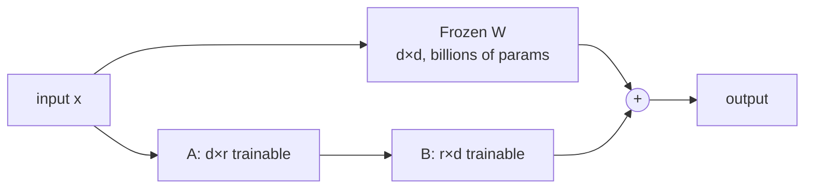
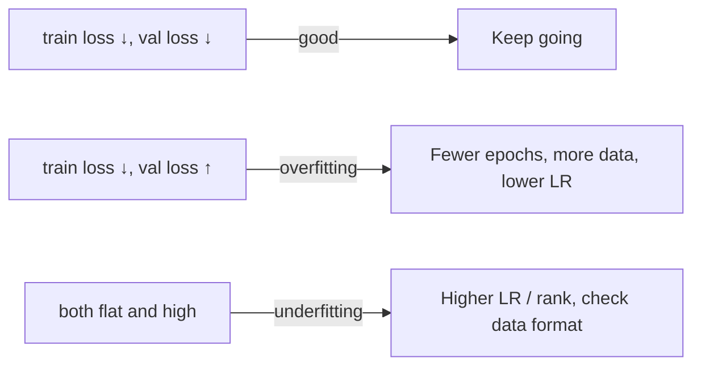

# Module 7 — Parameter-Efficient Model Adaptation (LoRA / QLoRA)

> Phase 4 · Weeks 14–15 · Level 3 Adapt and Act · [Syllabus](../SYLLABUS.md#module-7-parameter-efficient-model-adaptation)

**Goal:** fine-tune an open-source model on your data on a single free GPU, evaluate it against the base model,
and run it locally in Ollama.

**Where to run:** Google Colab (free T4 GPU, 15 GB) or Kaggle notebooks. Not on a CPU laptop.

## 7.1 PEFT concepts

Full fine-tuning updates **all** billions of weights — needs huge GPUs. **Parameter-efficient fine-tuning (PEFT)**
freezes the model and trains a tiny add-on.

### LoRA — Low-Rank Adaptation

For a frozen weight matrix `W` (d × d), learn two thin matrices `A` (d × r) and `B` (r × d) with small rank `r`
(8–64). New behaviour = `W + B·A`. Trains ~0.1–1% of parameters.



### QLoRA

Load the frozen base model in **4-bit** (bitsandbytes NF4) and train LoRA adapters on top → a 7B model fits in
~6 GB of GPU memory.

| Method | Trainable params | GPU for 7B | Quality |
|---|---|---|---|
| Full fine-tune | 100% | 80 GB+ ×N | Best, risky |
| LoRA (16-bit base) | ~0.5% | ~20 GB | Near full |
| QLoRA (4-bit base) | ~0.5% | ~6–8 GB | Slightly below LoRA |

Key LoRA hyperparameters: `r` (rank, capacity), `lora_alpha` (scaling, often 2×r), `target_modules`
(which layers — attention and MLP projections), `lora_dropout`.

---

## 7.2 Tooling

| Tool | Role |
|---|---|
| Hugging Face Transformers | Load models/tokenizers |
| PEFT | LoRA/QLoRA adapters |
| TRL (`SFTTrainer`) | Supervised fine-tuning loop |
| bitsandbytes | 4-bit/8-bit quantization |
| **Unsloth** | 2× faster, less memory; great on Colab |
| Axolotl | Config-file (YAML) driven training |

## 7.3 Training run (Unsloth on Colab)

```python
# Colab cell 1
# !pip install unsloth
from unsloth import FastLanguageModel
from datasets import load_dataset
from trl import SFTConfig, SFTTrainer

model, tokenizer = FastLanguageModel.from_pretrained(
    model_name="unsloth/Qwen2.5-1.5B-Instruct-bnb-4bit",   # small = fast; try Llama-3.2-3B later
    max_seq_length=2048, load_in_4bit=True,
)
model = FastLanguageModel.get_peft_model(
    model, r=16, lora_alpha=32, lora_dropout=0,
    target_modules=["q_proj", "k_proj", "v_proj", "o_proj", "gate_proj", "up_proj", "down_proj"],
)

ds = load_dataset("json", data_files={"train": "train.jsonl", "validation": "val.jsonl"})
def to_text(ex):
    return {"text": tokenizer.apply_chat_template(ex["messages"], tokenize=False)}
ds = ds.map(to_text)

trainer = SFTTrainer(
    model=model, tokenizer=tokenizer,
    train_dataset=ds["train"], eval_dataset=ds["validation"],
    args=SFTConfig(
        dataset_text_field="text", max_seq_length=2048,
        per_device_train_batch_size=2, gradient_accumulation_steps=4,
        num_train_epochs=2, learning_rate=2e-4, warmup_steps=10,
        logging_steps=10, eval_strategy="steps", eval_steps=50,
        output_dir="outputs", report_to="none",
    ),
)
trainer.train()
model.save_pretrained("lora_adapter"); tokenizer.save_pretrained("lora_adapter")
```

Watch the loss:



Starting hyperparameters: lr `2e-4`, 1–3 epochs, effective batch 8–16, rank 16.

## 7.4 Evaluate and serve

```python
FastLanguageModel.for_inference(model)
def generate(msgs):
    ids = tokenizer.apply_chat_template(msgs, add_generation_prompt=True, return_tensors="pt").to("cuda")
    out = model.generate(input_ids=ids, max_new_tokens=256, temperature=0.0, do_sample=False)
    return tokenizer.decode(out[0][ids.shape[1]:], skip_special_tokens=True)
```

Run the **same test set** through base and tuned models and score them with Module 3's eval code. Also run 20
general questions to check for **catastrophic forgetting**.

| Model | Task score | General score | Latency |
|---|---|---|---|
| Base 1.5B + prompt | | | |
| Tuned 1.5B | | | |
| Large model via API (reference) | | | |

## 7.5 Back to local: GGUF → Ollama

```python
# In Colab: merge adapter and export quantized GGUF
model.save_pretrained_gguf("gguf_model", tokenizer, quantization_method="q4_k_m")
```

Download the `.gguf`, then on your laptop:

```dockerfile
# Modelfile
FROM ./gguf_model/unsloth.Q4_K_M.gguf
PARAMETER temperature 0
SYSTEM "Extract invoice fields as JSON."
```

```bash
ollama create invoice-extractor -f Modelfile
ollama run invoice-extractor "Invoice #88 from Tata Steel, 2 Jan 2026, total ₹12,000"
```

Your fine-tuned model now plugs into every earlier project by changing `MODEL=invoice-extractor`.

Other servers: **vLLM** (high-throughput GPU serving, OpenAI-compatible), **llama.cpp server** (CPU/GPU, GGUF).

## Hands-on — Project 4: Specialise a Model

1. Pick one narrow task (classification, extraction, or a fixed-format rewrite).
2. 300–1,000 examples (real + filtered synthetic), train/val/test split.
3. Baseline → QLoRA fine-tune → compare on the test set.
4. Export to GGUF, run in Ollama.
5. Write the decision log (Module 6 template).

## Checkpoint

- [ ] Loss curves saved; no obvious overfitting.
- [ ] Tuned vs base comparison table with real numbers.
- [ ] Model runs locally via `ollama run`.
- [ ] Decision log states when fine-tuning was and wasn't worth it.

## Key terms

| Term | Meaning |
|---|---|
| LoRA | Train small low-rank matrices beside frozen weights |
| QLoRA | LoRA on a 4-bit quantized base model |
| Adapter | The small trained LoRA weights (MBs, not GBs) |
| Epoch | One pass through the training data |
| Merge | Folding adapter weights into the base model |
