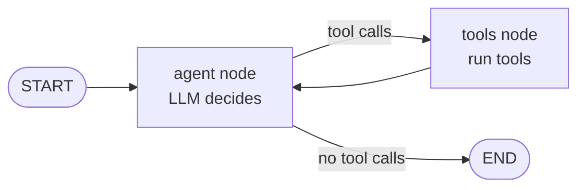
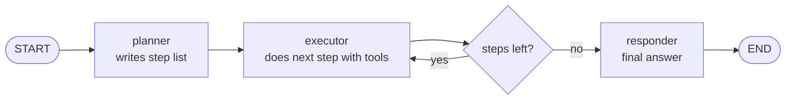
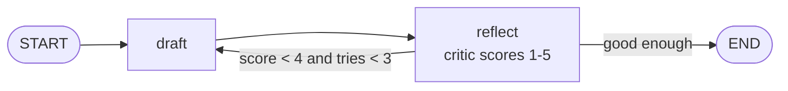
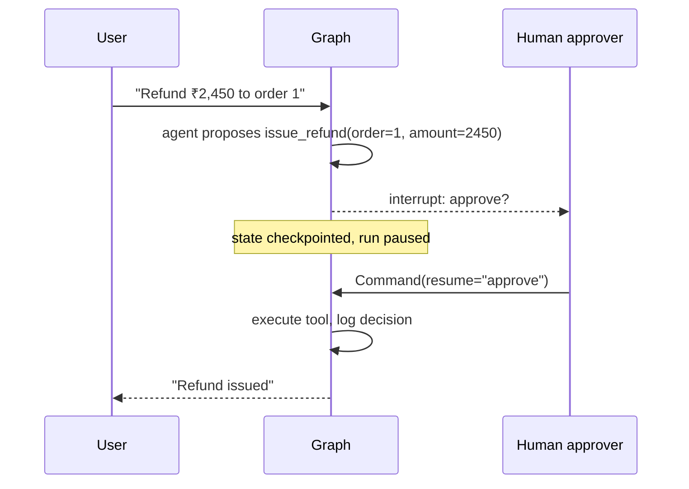

# Module 9 — Agent Orchestration and Human Oversight (LangGraph)

> Phase 5 · Weeks 18–19 · Level 3 Adapt and Act · [Syllabus](../SYLLABUS.md#module-9-agent-orchestration-and-human-oversight)

**Goal:** design agent workflows where a human stays in the loop at the right moments, state survives restarts,
and every decision is auditable.

```bash
cd projects/05-tool-agent
uv add langgraph langchain-ollama langchain-core
```

## 9.1 LangGraph fundamentals

A LangGraph app is a **state machine**:

| Concept | Meaning |
|---|---|
| **State** | A typed dict shared by all nodes (messages, plan, results…) |
| **Node** | A Python function: takes state, returns updates |
| **Edge** | Which node runs next — fixed or **conditional** |
| **Checkpointer** | Saves state after every step → pause, resume, time-travel, crash recovery |



### The ReAct agent as a graph

```python
from typing import Annotated, TypedDict

from langchain_core.messages import HumanMessage
from langchain_core.tools import tool
from langchain_ollama import ChatOllama
from langgraph.checkpoint.memory import MemorySaver
from langgraph.graph import END, START, StateGraph
from langgraph.graph.message import add_messages
from langgraph.prebuilt import ToolNode, tools_condition


@tool
def calculator(expression: str) -> str:
    """Evaluate an arithmetic expression like '3650 * 0.18'."""
    return str(safe_eval(expression))          # the ast-based evaluator from Module 8


@tool
def get_order_total(customer: str) -> float:
    """Total order amount for a customer."""
    return {"Asha": 3650.0, "Ravi": 990.0}.get(customer, 0.0)


tools = [calculator, get_order_total]
llm = ChatOllama(model="qwen2.5:7b", temperature=0).bind_tools(tools)


class State(TypedDict):
    messages: Annotated[list, add_messages]    # add_messages appends instead of overwriting


def agent(state: State) -> dict:
    return {"messages": [llm.invoke(state["messages"])]}


graph = StateGraph(State)
graph.add_node("agent", agent)
graph.add_node("tools", ToolNode(tools))
graph.add_edge(START, "agent")
graph.add_conditional_edges("agent", tools_condition)   # → "tools" if tool calls, else END
graph.add_edge("tools", "agent")
app = graph.compile(checkpointer=MemorySaver())

config = {"configurable": {"thread_id": "user-42"}, "recursion_limit": 12}   # step guard
out = app.invoke({"messages": [HumanMessage("18% GST on Asha's total?")]}, config)
print(out["messages"][-1].content)
```

`thread_id` = one conversation; the checkpointer remembers it across calls. Use `SqliteSaver`/`PostgresSaver`
in production so state survives restarts.

---

## 9.2 Planner–executor systems



```python
from pydantic import BaseModel

class Plan(BaseModel):
    steps: list[str]

class PEState(TypedDict):
    goal: str
    steps: list[str]
    results: list[str]

planner_llm = ChatOllama(model="qwen2.5:7b", temperature=0).with_structured_output(Plan)

def planner(s: PEState):
    return {"steps": planner_llm.invoke(f"Plan 2-5 steps for: {s['goal']}").steps, "results": []}

def executor(s: PEState):
    step = s["steps"][len(s["results"])]
    res = app.invoke({"messages": [HumanMessage(f"{step}\nContext: {s['results']}")]},
                     {"configurable": {"thread_id": f"exec-{step}"}})
    return {"results": s["results"] + [res["messages"][-1].content]}

def more_steps(s: PEState):
    return "executor" if len(s["results"]) < len(s["steps"]) else END

pe = StateGraph(PEState)
pe.add_node("planner", planner); pe.add_node("executor", executor)
pe.add_edge(START, "planner"); pe.add_edge("planner", "executor")
pe.add_conditional_edges("executor", more_steps)
plan_app = pe.compile()
```

Separating planning from doing makes long tasks inspectable and lets you use a strong model to plan and a cheap one to execute.

---

## 9.3 Reflection and self-correction



```python
class Critique(BaseModel):
    score: int
    feedback: str

class RState(TypedDict):
    task: str
    draft: str
    critique: str
    score: int
    tries: int

writer = ChatOllama(model="llama3.2:3b", temperature=0.4)
critic = ChatOllama(model="qwen2.5:7b", temperature=0).with_structured_output(Critique)

def draft(s):
    prompt = s["task"] if not s.get("critique") else f"{s['task']}\nImprove using feedback: {s['critique']}\nPrevious: {s['draft']}"
    return {"draft": writer.invoke(prompt).content, "tries": s.get("tries", 0) + 1}

def reflect(s):
    c = critic.invoke(f"Score 1-5 and give feedback.\nTask: {s['task']}\nDraft: {s['draft']}")
    return {"critique": c.feedback, "score": c.score}

g = StateGraph(RState)
g.add_node("draft", draft); g.add_node("reflect", reflect)
g.add_edge(START, "draft"); g.add_edge("draft", "reflect")
g.add_conditional_edges("reflect", lambda s: END if s["score"] >= 4 or s["tries"] >= 3 else "draft")
reflect_app = g.compile()
```

Always cap the loop (`tries`) — reflection can oscillate forever.

---

## 9.4 Human-in-the-loop (HITL)



```python
from langgraph.types import Command, interrupt

@tool
def issue_refund(order_id: int, amount: float) -> str:
    """Issue a refund. REQUIRES human approval."""
    decision = interrupt({"action": "issue_refund", "order_id": order_id, "amount": amount})
    if decision != "approve":
        return f"Refund rejected by reviewer: {decision}"
    audit_log("issue_refund", order_id=order_id, amount=amount, approved_by="reviewer")
    return f"Refund of ₹{amount} issued for order {order_id}"
```

(Add `issue_refund` to `tools` and rebuild the graph.)

```python
cfg = {"configurable": {"thread_id": "refund-1"}}
result = app.invoke({"messages": [HumanMessage("Refund ₹2,450 for order 1")]}, cfg)
print(result["__interrupt__"])                      # what needs approval — show this in your UI

# ... later, maybe hours later, after the human clicks Approve:
final = app.invoke(Command(resume="approve"), cfg)
print(final["messages"][-1].content)
```

**Where to put approval gates:** money movement, sending external messages, deleting/changing data, low-confidence
answers, anything irreversible. **Escalation:** route to a human when the agent is stuck, confidence is low or the user asks.

### Audit trail

```python
import json, datetime

def audit_log(action: str, **fields):
    entry = {"ts": datetime.datetime.utcnow().isoformat(), "action": action, **fields}
    with open("audit.jsonl", "a") as f:
        f.write(json.dumps(entry) + "\n")
```

Record: who asked, what the agent proposed, who approved, what was executed, result. Required for governance (Module 11).

---

## 9.5 Streaming agent UX

Users should see progress, not a spinner for 40 seconds.

```python
for mode, chunk in app.stream({"messages": [HumanMessage("Asha's total with GST?")]},
                              {"configurable": {"thread_id": "s1"}}, stream_mode=["updates", "messages"]):
    if mode == "updates":
        for node, update in chunk.items():
            print(f"\n[{node}] finished")            # step-level progress: "calling get_order_total…"
    elif mode == "messages":
        token, meta = chunk
        if token.content:
            print(token.content, end="", flush=True) # token-level streaming of the answer
```

Good agent UX: show tool calls as they happen, stream the final answer, allow **cancel** (interrupt) mid-run,
show what needs approval and why.

---

## 9.6 Evaluating agents

| Level | Metric | How |
|---|---|---|
| Final answer | Task success rate | Golden tasks + checker or LLM judge |
| Trajectory | Right tools, right order, no wasted steps | Compare tool-call sequence to expected |
| Tool calls | Argument accuracy | Exact match on args |
| Efficiency | Steps, tokens, latency, cost per task | From traces |
| Safety | Blocked unsafe actions | Adversarial test tasks |

```python
def trajectory(messages) -> list[str]:
    return [tc["name"] for m in messages for tc in getattr(m, "tool_calls", []) or []]

case = {"q": "18% GST on Asha's total?", "expected_tools": ["get_order_total", "calculator"], "expected": "657"}
out = app.invoke({"messages": [HumanMessage(case["q"])]}, {"configurable": {"thread_id": "eval-1"}})
print("tools ok:", trajectory(out["messages"]) == case["expected_tools"],
      "answer ok:", case["expected"] in out["messages"][-1].content)
```

## Hands-on — rebuild Project 5 in LangGraph

1. ReAct graph with your three tools + a `SqliteSaver` checkpointer.
2. Add a risky tool (e.g. `send_email` or `issue_refund`) behind `interrupt()` approval.
3. Append every approval decision to `audit.jsonl`.
4. Stream progress in a CLI.
5. 10-case trajectory eval.

## Checkpoint

- [ ] A run pauses for approval, the process restarts, and it resumes from saved state.
- [ ] Rejecting an approval leads to a safe explanation, not a crash.
- [ ] Trajectory eval report committed.

## Key terms

| Term | Meaning |
|---|---|
| State graph | Workflow of nodes and edges over shared state |
| Checkpointer | Persists graph state after each step |
| Interrupt | Pause the graph waiting for external input |
| HITL | Human-in-the-loop approval or correction |
| Trajectory | The sequence of actions an agent took |
