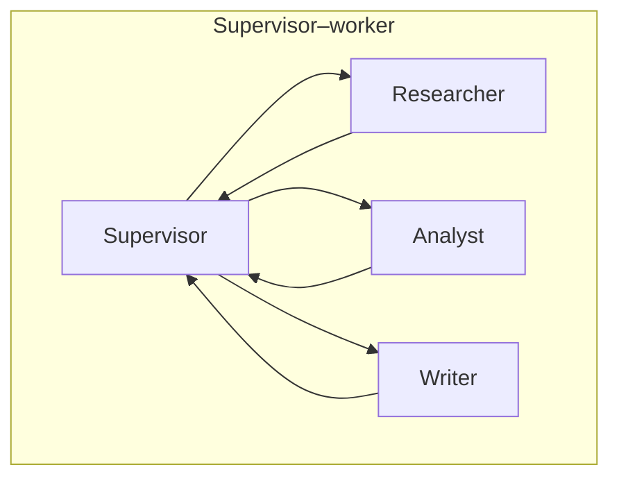
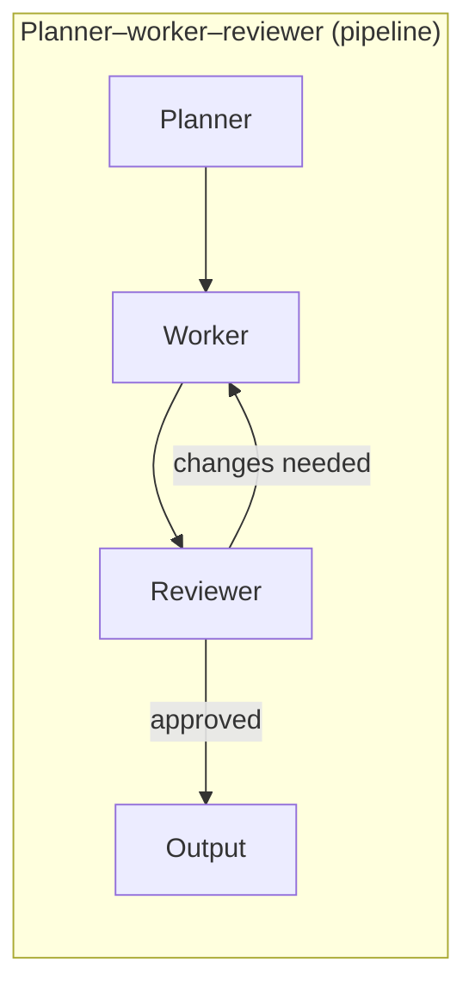
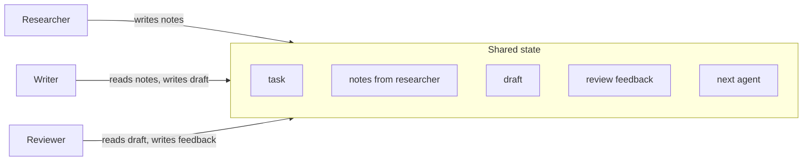
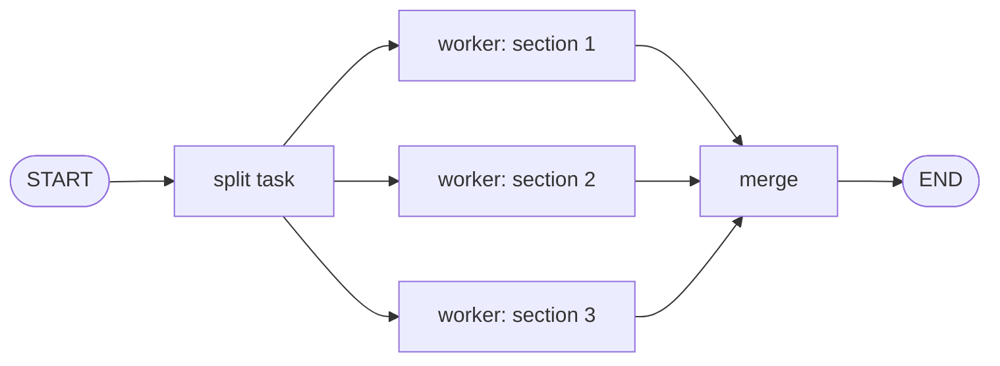
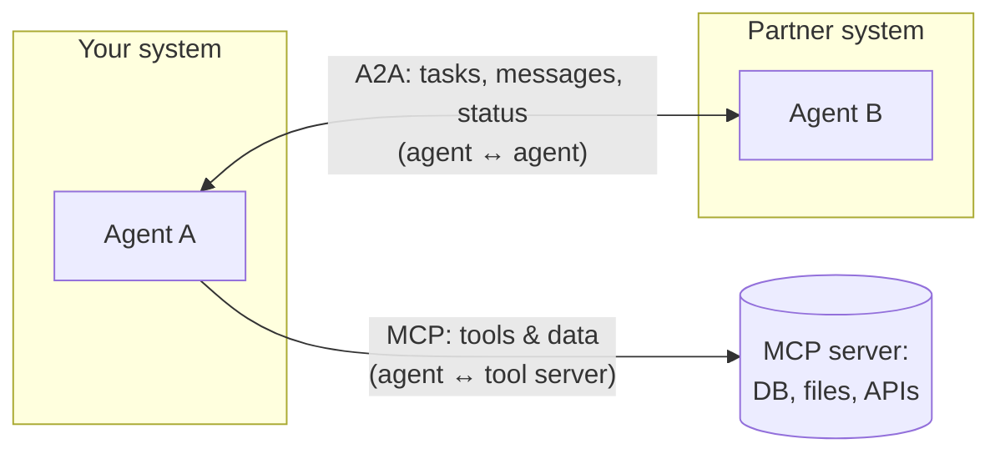

# Module 10 — Multi-Agent Coordination Systems

> Phase 5 · Week 20 · Level 3 Adapt and Act · [Syllabus](../SYLLABUS.md#module-10-multi-agent-coordination-systems)

**Goal:** coordinate several agents on one task — and know when one agent is the smarter call.

```bash
cd projects/05-tool-agent
uv add langgraph langchain-ollama crewai
```

## 10.1 Architectures





| Pattern | How | Good for |
|---|---|---|
| Single agent + tools | One loop | Most tasks — start here |
| Supervisor–worker | Router agent delegates to specialists | Distinct skill areas with different tools |
| Pipeline / crew | Fixed hand-off order | Research → write → review |
| Handoffs (swarm) | Agents transfer control to each other | Customer service triage |
| Debate / parallel | Several agents answer, one judges | Hard reasoning, reducing errors |

Why split at all: **smaller prompts and tool sets per agent** (models pick tools worse as the list grows), separate
permissions, parallelism, different models per role (cheap worker, strong reviewer).

---

## 10.2 Shared state and communication



Two styles: **shared blackboard** (everyone reads/writes one state — LangGraph) or **message passing** (agents
send each other messages — CrewAI, A2A). Keep hand-offs **structured** (Pydantic), not free chat.

### Supervisor–worker in LangGraph

```python
from typing import Literal, TypedDict

from langchain_ollama import ChatOllama
from langgraph.graph import END, START, StateGraph
from pydantic import BaseModel

llm = ChatOllama(model="qwen2.5:7b", temperature=0)


class Route(BaseModel):
    next: Literal["researcher", "writer", "reviewer", "FINISH"]
    reason: str


class TeamState(TypedDict):
    task: str
    notes: str
    draft: str
    feedback: str
    turns: int


def supervisor(s: TeamState) -> dict:
    route = llm.with_structured_output(Route).invoke(
        f"""You manage a researcher, writer and reviewer.
Task: {s['task']}
Have notes: {bool(s.get('notes'))}. Have draft: {bool(s.get('draft'))}. Reviewer feedback: {s.get('feedback') or 'none'}.
Choose who works next, or FINISH if the reviewer approved.""")
    return {"next": route.next, "turns": s.get("turns", 0) + 1}


def researcher(s):  # in a real system: tools = search_docs, web search
    return {"notes": llm.invoke(f"List 5 key facts for: {s['task']}").content}

def writer(s):
    return {"draft": llm.invoke(f"Write a 150-word brief.\nFacts: {s['notes']}\nFeedback: {s.get('feedback', '')}").content}

def reviewer(s):
    return {"feedback": llm.invoke(f"Review this brief. Reply APPROVED or list fixes.\n{s['draft']}").content}


class RoutedState(TeamState, total=False):
    next: str

g = StateGraph(RoutedState)
for name, fn in [("supervisor", supervisor), ("researcher", researcher), ("writer", writer), ("reviewer", reviewer)]:
    g.add_node(name, fn)
g.add_edge(START, "supervisor")
g.add_conditional_edges("supervisor",
    lambda s: END if s["next"] == "FINISH" or s["turns"] > 8 else s["next"])   # turn budget
for worker in ("researcher", "writer", "reviewer"):
    g.add_edge(worker, "supervisor")
team = g.compile()

print(team.invoke({"task": "Explain UPI to a first-time user in rural India"})["draft"])
```

### The same crew in CrewAI

```python
from crewai import LLM, Agent, Crew, Process, Task

local = LLM(model="ollama/qwen2.5:7b", base_url="http://localhost:11434")

researcher = Agent(role="Researcher", goal="Find accurate key facts", backstory="Careful fact-finder", llm=local)
writer = Agent(role="Writer", goal="Write clear briefs for beginners", backstory="Plain-language expert", llm=local)
reviewer = Agent(role="Reviewer", goal="Catch errors and jargon", backstory="Strict editor", llm=local)

t1 = Task(description="Collect 5 key facts about {topic}", expected_output="Bullet list", agent=researcher)
t2 = Task(description="Write a 150-word brief from the facts", expected_output="Brief", agent=writer, context=[t1])
t3 = Task(description="Review and return the corrected final brief", expected_output="Final brief", agent=reviewer, context=[t2])

crew = Crew(agents=[researcher, writer, reviewer], tasks=[t1, t2, t3], process=Process.sequential, verbose=True)
print(crew.kickoff(inputs={"topic": "UPI for first-time users"}))
```

---

## 10.3 Coordination failures

| Failure | Symptom | Defence |
|---|---|---|
| Infinite ping-pong | Writer ↔ reviewer never converge | Turn budget, "approve if only minor issues" rule |
| Lost context | Worker lacks info another agent had | Structured shared state; pass artefacts, not summaries of summaries |
| Conflicting outputs | Two agents disagree, no arbiter | One owner per decision; supervisor or judge resolves |
| Error amplification | One hallucination spreads | Reviewer verifies against sources |
| Runaway cost | 10 agents × 10 turns × long prompts | Token/cost budget per run; cheap models for workers |

## 10.4 Cost and latency

- Cost ≈ Σ (agents × turns × tokens per turn). Measure it per run (Module 12 traces).
- **Parallelise** independent workers (LangGraph fan-out: several edges from one node; results merged by a reducer).
- Use small models for routing and drafting, a strong model only where it matters (reviewer/judge).



## 10.5 When NOT to use multi-agent

Use a single agent when: the task fits one prompt and ≤ ~10 tools; steps are sequential; latency matters; you
can't yet evaluate one agent well. Multi-agent systems are harder to debug, slower and costlier — earn the
complexity with measured gains.

## 10.6 Agent-to-agent protocols (A2A) and MCP



- **MCP** (Module 11) standardises how an agent connects to **tools and data**.
- **A2A** (Agent2Agent) standardises how **independent agents** discover each other (an "agent card"), send tasks and
  stream status — even across companies and frameworks.

## Hands-on — crew comparison

Solve the **same 10 tasks** with (a) your single Project 5 agent and (b) the planner–worker–reviewer crew.

| Setup | Success rate | Avg steps | Avg tokens | Avg latency |
|---|---|---|---|---|
| Single agent | | | | |
| 3-agent crew | | | | |

## Checkpoint

- [ ] Supervisor graph runs with a turn budget and never loops forever.
- [ ] Comparison table with real numbers and a written recommendation.
- [ ] You can explain the difference between MCP and A2A.

## Key terms

| Term | Meaning |
|---|---|
| Supervisor | Agent that routes work to other agents |
| Hand-off | Transferring control/task to another agent |
| Fan-out / fan-in | Running workers in parallel, then merging |
| A2A | Protocol for agent-to-agent communication |
