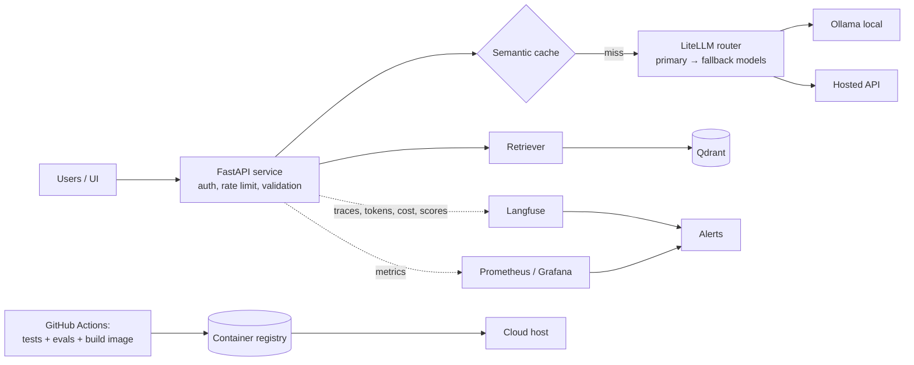
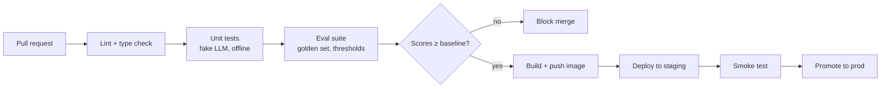
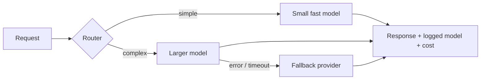

# Module 12 — AI Deployment, Observability and Runtime Operations

> Phase 6 · Weeks 22–23 · Level 4 Ship · [Syllabus](../SYLLABUS.md#module-12-ai-deployment-observability-and-runtime-operations)

**Goal:** your AI system is live, monitored, and you get alerted before the user does when something goes wrong.

```bash
cd projects/04-mini-rag      # we ship the Grounded Q&A service
uv add fastapi "uvicorn[standard]" langfuse litellm prometheus-client
```

## Production architecture



---

## 12.1 Observability: logs, traces, metrics

| Signal | Answers | Example |
|---|---|---|
| Logs | What happened in this request? | JSON line per LLM call (Module 1) |
| **Traces** | Where did time and money go across steps? | retrieve 120 ms → rerank 300 ms → LLM 2.1 s |
| Metrics | How is the system doing overall? | p95 latency, error rate, tokens/min, cost/day |
| Evals/scores | Is quality holding up? | Groundedness score per answer, thumbs up/down |

```mermaid
gantt
    title One traced request (span timeline)
    dateFormat X
    axisFormat %L ms
    section /ask
    embed query        :0, 80
    vector search      :80, 150
    rerank             :150, 450
    LLM generation     :450, 2600
    guardrail check    :2600, 2700
```



### Langfuse (open source, self-hostable, free cloud tier)

```bash
# self-host locally
git clone https://github.com/langfuse/langfuse && cd langfuse && docker compose up -d   # UI at http://localhost:3000
```

```dotenv
LANGFUSE_PUBLIC_KEY=pk-lf-...
LANGFUSE_SECRET_KEY=sk-lf-...
LANGFUSE_HOST=http://localhost:3000
```

```python
from langfuse import get_client, observe
import ollama

langfuse = get_client()

@observe(name="retrieve")
def retrieve(question: str) -> list[str]:
    ...  # your hybrid retriever + reranker
    return ["UPI refunds take 3-5 working days."]

@observe(name="generate", as_type="generation")
def generate(question: str, chunks: list[str]) -> str:
    r = ollama.chat(model="llama3.2:3b", messages=[{"role": "user", "content": f"{chunks}\n\n{question}"}])
    langfuse.update_current_generation(
        model="llama3.2:3b",
        usage_details={"input": r.prompt_eval_count, "output": r.eval_count},
    )
    return r.message.content

@observe(name="ask")
def ask(question: str, user_id: str) -> str:
    langfuse.update_current_trace(user_id=user_id, tags=["grounded-qa", "prompt-v3"])
    return generate(question, retrieve(question))

print(ask("How long do refunds take?", user_id="u-42"))
langfuse.flush()
```

Each request becomes a trace with nested spans, token counts, cost (set model prices in Langfuse), latency and
metadata. Attach **scores** (user feedback, LLM-judge groundedness) to traces to monitor quality over time:

```python
langfuse.create_score(trace_id=trace_id, name="user_feedback", value=1)   # thumbs up
```

(The Langfuse SDK changed between v2 and v3 — the code above is v3 style; check the docs for your version.)

### Metrics for dashboards and alerts

```python
from prometheus_client import Counter, Histogram, make_asgi_app

REQUESTS = Counter("ask_requests_total", "Requests", ["status"])
LATENCY = Histogram("ask_latency_seconds", "End-to-end latency")
TOKENS = Counter("llm_tokens_total", "Tokens", ["model", "kind"])

app.mount("/metrics", make_asgi_app())       # Prometheus scrapes this; Grafana charts it
```

Alert on: error rate > 2%, p95 latency > target, cost/day > budget, groundedness score dropping, abstention rate spiking.

---

## 12.2 Packaging with Docker

```dockerfile
# Dockerfile
FROM python:3.11-slim
COPY --from=ghcr.io/astral-sh/uv:latest /uv /usr/local/bin/uv
WORKDIR /app
COPY pyproject.toml uv.lock ./
RUN uv sync --frozen --no-dev
COPY src ./src
ENV PATH="/app/.venv/bin:$PATH" PYTHONUNBUFFERED=1
RUN useradd -m appuser
USER appuser
EXPOSE 8000
HEALTHCHECK CMD python -c "import urllib.request; urllib.request.urlopen('http://localhost:8000/health')"
CMD ["uvicorn", "src.app:app", "--host", "0.0.0.0", "--port", "8000"]
```

```yaml
# docker-compose.yml — the whole stack locally
services:
  api:
    build: .
    ports: ["8000:8000"]
    env_file: .env
    environment:
      OLLAMA_HOST: http://ollama:11434
      QDRANT_URL: http://qdrant:6333
    depends_on: [ollama, qdrant]
  ollama:
    image: ollama/ollama
    volumes: [ollama:/root/.ollama]
  qdrant:
    image: qdrant/qdrant
    volumes: [qdrant:/qdrant/storage]
volumes: { ollama: {}, qdrant: {} }
```

```bash
docker compose up -d --build
docker compose exec ollama ollama pull llama3.2:3b
curl localhost:8000/health
```

Rules: secrets via environment/secret manager (never baked into images), non-root user, pinned versions (`uv.lock`), small base image.

---

## 12.3 CI/CD for AI



```yaml
# .github/workflows/ci.yml
name: ci
on: [pull_request, push]
jobs:
  test:
    runs-on: ubuntu-latest
    steps:
      - uses: actions/checkout@v4
      - uses: astral-sh/setup-uv@v5
      - run: uv sync --frozen
      - run: uv run ruff check .
      - run: uv run pytest -q                       # offline, fake LLM

  eval:
    runs-on: ubuntu-latest
    needs: test
    steps:
      - uses: actions/checkout@v4
      - uses: astral-sh/setup-uv@v5
      - run: uv sync --frozen
      - name: Start Ollama with a small model
        run: |
          curl -fsSL https://ollama.com/install.sh | sh
          ollama serve & sleep 5
          ollama pull llama3.2:1b
      - run: uv run python eval.py --min-hit-rate 0.8 --min-faithfulness 0.7   # exits 1 if below
```

```python
# eval.py (sketch) — regression gate
import argparse, sys
p = argparse.ArgumentParser(); p.add_argument("--min-hit-rate", type=float); p.add_argument("--min-faithfulness", type=float)
a = p.parse_args()
scores = run_eval_suite()                       # your Module 5 metrics on the golden set
print(scores)
sys.exit(0 if scores["hit_rate"] >= a.min_hit_rate and scores["faithfulness"] >= a.min_faithfulness else 1)
```

Evaluate on **every prompt, model or index change** — they break quality as surely as code changes.

---

## 12.4 Runtime reliability: versioning, routing, fallbacks, caching

### Prompt and model versioning

Store prompts in files or in Langfuse Prompt Management; log `prompt_version` + `model` + `index_version` on every trace
so any answer can be reproduced.

### Model routing and fallbacks with LiteLLM

```python
from litellm import Router

router = Router(
    model_list=[
        {"model_name": "fast", "litellm_params": {"model": "ollama/llama3.2:3b", "api_base": "http://localhost:11434"}},
        {"model_name": "smart", "litellm_params": {"model": "ollama/qwen2.5:7b", "api_base": "http://localhost:11434"}},
        {"model_name": "smart-cloud", "litellm_params": {"model": "groq/llama-3.3-70b-versatile"}},  # needs GROQ_API_KEY
    ],
    fallbacks=[{"smart": ["smart-cloud"]}],            # if local 'smart' fails → cloud
    num_retries=2, timeout=60,
)

def pick_model(question: str) -> str:
    """Cheap heuristic router; could also be a small classifier model."""
    return "smart" if len(question) > 200 or any(w in question.lower() for w in ("why", "compare", "explain")) else "fast"

resp = router.completion(model=pick_model("What is UPI?"), messages=[{"role": "user", "content": "What is UPI?"}])
print(resp.choices[0].message.content, resp.usage)
```



Also: semantic caching (Module 5) in front of the model, **token budgets** per user/day, circuit breakers (Module 8),
graceful degradation ("search results only" if the LLM is down).

---

## 12.5 Demo UI

```python
# ui.py   run: uv run streamlit run ui.py      (uv add streamlit requests)
import requests
import streamlit as st

st.title("Grounded Q&A")
if "history" not in st.session_state:
    st.session_state.history = []
for role, text in st.session_state.history:
    st.chat_message(role).write(text)

if q := st.chat_input("Ask about the documents"):
    st.chat_message("user").write(q)
    r = requests.post("http://localhost:8000/ask", json={"question": q}, timeout=120).json()
    answer = r["answer"] + "\n\n" + "\n".join(f"- {s}" for s in r.get("sources", []))
    st.chat_message("assistant").write(answer)
    st.session_state.history += [("user", q), ("assistant", answer)]
```

Alternatives: **Gradio** (`gr.ChatInterface`), **Chainlit** (chat UI with step/tool visualisation).

## 12.6 Hosting, secrets and load testing

| Option | Notes |
|---|---|
| Hugging Face Spaces | Free tier for demos (Gradio/Streamlit/Docker) |
| Render / Railway / Fly.io | Deploy a Docker image from GitHub |
| Google Cloud Run / AWS App Runner / Azure Container Apps | Scalable containers, pay per use |
| GPU for local models | RunPod, Modal, or use a hosted API in production and Ollama for dev |

Cheap-hosting reality: CPU-only free tiers can't run a 7B model fast — deploy the API + vector DB, and call a hosted
or free-tier model endpoint through the LiteLLM router.

Secrets: platform secret store or cloud secret manager; rotate keys; separate keys per environment.

Load testing:

```python
# locustfile.py   run: uv run locust -f locustfile.py --host http://localhost:8000
from locust import HttpUser, between, task

class AskUser(HttpUser):
    wait_time = between(1, 3)

    @task
    def ask(self):
        self.client.post("/ask", json={"question": "How long do refunds take?"}, timeout=120)
```

Set a **latency budget** (e.g. p95 < 4 s, TTFT < 1 s) and find the concurrency where it breaks.

---

## Hands-on

1. Dockerise the Grounded Q&A service; `docker compose up` runs API + Ollama + Qdrant.
2. Langfuse traces with spans for retrieve/rerank/generate, token usage and a feedback score.
3. GitHub Actions: lint, tests, eval gate.
4. LiteLLM router with a fallback; kill the primary and show the fallback in traces.
5. Streamlit UI; deploy to a free host.

## Checkpoint

- [ ] A dashboard shows latency, cost/tokens and quality per request.
- [ ] A PR that lowers eval scores fails CI.
- [ ] Load test report with p50/p95 latency at 1, 5, 10 concurrent users.

## Key terms

| Term | Meaning |
|---|---|
| Trace / span | One request / one timed step inside it |
| p95 latency | 95% of requests are faster than this |
| Eval gate | CI step that fails when quality drops |
| Fallback | Alternative model/provider used on failure |
| Model routing | Choosing a model per request by difficulty/cost |
