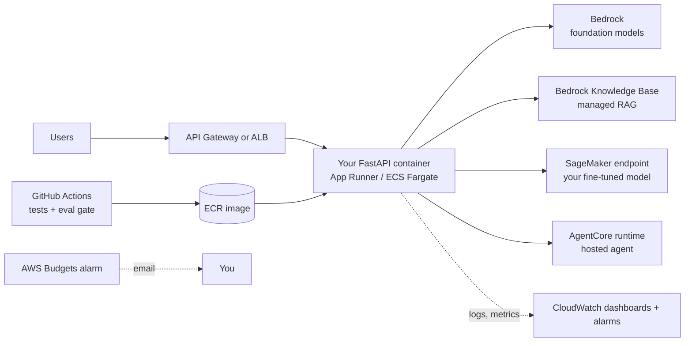

# Module 12A — Cloud AI on AWS [Crio]

> Ship · Week 26 · [Syllabus](../SYLLABUS.md#module-12a--cloud-ai-on-aws-week-26-crio)

**Goal:** take an earlier build from "works on my laptop" to a monitored, cost-controlled service on AWS, so
your résumé can say "deployed on AWS", with a dashboard to prove it.

> **Cost warning.** Set up a budget alarm **before** you create anything (12A.5). Delete endpoints when you are done:
> a SageMaker endpoint bills every hour it is running, even with zero traffic.

```bash
uv add boto3
aws configure        # AWS CLI v2: access key of an IAM user with least privilege, region e.g. us-east-1 or ap-south-1
```

## 12A.1 Cloud AI ecosystems compared

| Need | AWS | Azure | Google Cloud |
|---|---|---|---|
| Managed foundation models | **Bedrock** (Claude, Llama, Mistral, Amazon Nova, …) | Azure AI Foundry (OpenAI models, others) | Vertex AI (Gemini, others) |
| Managed RAG | Bedrock Knowledge Bases | Azure AI Search + "on your data" | Vertex AI Search / RAG Engine |
| Hosted agents | **Bedrock AgentCore**, Bedrock Agents | Azure AI Agent Service | Vertex AI Agent Engine |
| Host your own model | **SageMaker** endpoints | Azure ML endpoints | Vertex AI endpoints |
| Guardrails | Bedrock Guardrails | Azure AI Content Safety | Vertex safety filters |
| Monitoring | CloudWatch | Azure Monitor | Cloud Monitoring |

The concepts transfer; we do AWS hands-on.



## 12A.2 Amazon Bedrock: managed models

Enable model access first: Bedrock console → *Model access* → request the models you need.

```python
import os
import boto3

bedrock = boto3.client("bedrock-runtime", region_name=os.getenv("AWS_REGION", "us-east-1"))
MODEL_ID = os.environ["BEDROCK_MODEL_ID"]   # copy the exact ID from the Bedrock console (models change often)

resp = bedrock.converse(
    modelId=MODEL_ID,
    system=[{"text": "You are a concise assistant."}],
    messages=[{"role": "user", "content": [{"text": "Explain RAG in two sentences."}]}],
    inferenceConfig={"maxTokens": 300, "temperature": 0.2},
)
print(resp["output"]["message"]["content"][0]["text"])
print(resp["usage"], resp["metrics"]["latencyMs"], "ms")
```

The **Converse API** is the same for every Bedrock model, so you can switch models by changing `modelId`. It also
supports tool use (`toolConfig`) and streaming (`converse_stream`).

To plug Bedrock into your existing code instead, add it to the LiteLLM router from Module 12
(`model="bedrock/<model-id>"`), so local Ollama stays your development default.

### Bedrock Knowledge Bases (managed RAG)

Create a knowledge base in the console: point it at an S3 bucket of documents and pick an embedding model and vector store.
Then:

```python
agent_rt = boto3.client("bedrock-agent-runtime")
r = agent_rt.retrieve_and_generate(
    input={"text": "What is the refund policy?"},
    retrieveAndGenerateConfiguration={
        "type": "KNOWLEDGE_BASE",
        "knowledgeBaseConfiguration": {"knowledgeBaseId": os.environ["KB_ID"], "modelArn": os.environ["MODEL_ARN"]},
    },
)
print(r["output"]["text"])
for c in r["citations"]:
    print([ref["location"] for ref in c["retrievedReferences"]])
```

Compare it with your own AskDocs pipeline on the same golden set. Managed is faster to ship; your own gives more control.

### Bedrock Guardrails

Create a guardrail (denied topics, PII masking, prompt-attack filter) in the console and pass
`guardrailConfig={"guardrailIdentifier": ..., "guardrailVersion": "1"}` to `converse`.

## 12A.3 Bedrock AgentCore: hosting agents

AgentCore runs your agent code (LangGraph, CrewAI, plain Python) as a managed, scalable runtime with memory, identity,
tool gateway and observability services.

```python
# agent_app.py — wrap your Module 8/9 agent
from bedrock_agentcore.runtime import BedrockAgentCoreApp

app = BedrockAgentCoreApp()

@app.entrypoint
def invoke(payload: dict) -> dict:
    question = payload.get("prompt", "")
    return {"answer": run_agent(question)}     # your agent from Module 8/9, calling Bedrock models

if __name__ == "__main__":
    app.run()                                   # local test server
```

```bash
uv add bedrock-agentcore bedrock-agentcore-starter-toolkit
agentcore configure --entrypoint agent_app.py
agentcore launch                                # builds and deploys
agentcore invoke '{"prompt": "What is 18% GST on order 101?"}'
```

AgentCore is new and its SDK and CLI change quickly. Follow the current AWS quick-start if a command differs.

## 12A.4 SageMaker: host your own fine-tuned model

Use this for the DomainCopilot adapter from Module 7.

```python
import sagemaker
from sagemaker.huggingface import HuggingFaceModel, get_huggingface_llm_image_uri

role = sagemaker.get_execution_role()          # or an IAM role ARN when running outside SageMaker
model = HuggingFaceModel(
    role=role,
    image_uri=get_huggingface_llm_image_uri("huggingface"),     # Text Generation Inference container
    env={"HF_MODEL_ID": "your-hf-username/your-merged-model", "SM_NUM_GPUS": "1"},
)
predictor = model.deploy(initial_instance_count=1, instance_type="ml.g5.xlarge")
print(predictor.predict({"inputs": "Extract invoice fields: ...", "parameters": {"max_new_tokens": 200}}))

predictor.delete_endpoint()                   # ALWAYS clean up
```

GPU instances cost roughly a dollar or more per hour. Deploy, measure, record the results, then delete. Serverless
inference or Bedrock Custom Model Import are cheaper options to compare.

## 12A.5 Monitoring and cost alarms

**Budget alarm (do this first):** Billing console → *Budgets* → monthly cost budget (e.g. $10) with email alerts at 50%, 80%, 100%.

**App metrics in CloudWatch:**

```python
cw = boto3.client("cloudwatch")

def put_metrics(latency_ms: float, tokens: int, ok: bool):
    cw.put_metric_data(Namespace="AskDocs", MetricData=[
        {"MetricName": "LatencyMs", "Value": latency_ms, "Unit": "Milliseconds"},
        {"MetricName": "Tokens", "Value": tokens, "Unit": "Count"},
        {"MetricName": "Errors", "Value": 0 if ok else 1, "Unit": "Count"},
    ])

cw.put_metric_alarm(
    AlarmName="askdocs-p95-latency", Namespace="AskDocs", MetricName="LatencyMs",
    ExtendedStatistic="p95", Period=300, EvaluationPeriods=2, Threshold=5000,
    ComparisonOperator="GreaterThanThreshold", AlarmActions=[os.environ["SNS_TOPIC_ARN"]],
)
```

Bedrock also publishes its own CloudWatch metrics (invocations, latency, input and output tokens), and
*model invocation logging* stores every prompt and response to S3 or CloudWatch for audits. Mind PII.

## Deployment path for your container

| Option | Effort | Notes |
|---|---|---|
| **App Runner** | Lowest | Point at an ECR image; HTTPS and scaling built in |
| ECS on Fargate | Medium | More control, needs a load balancer and networking |
| Lambda | Low for small APIs | 15-minute limit; cold starts; fine for light endpoints |

CI/CD: extend the Module 12 GitHub Actions workflow to build, push to ECR and deploy only after tests **and** the eval gate pass.
Use GitHub OIDC with an IAM role instead of long-lived access keys.

## Build — ShipIt

1. Pick AskDocs or DomainCopilot.
2. Swap or add a Bedrock model behind your router; keep Ollama for local dev.
3. Containerise, push to ECR and deploy on App Runner (or AgentCore for the agent).
4. CloudWatch dashboard (latency, errors, tokens), a p95 alarm and a budget alarm.
5. **Incident fire-drill:** break something on purpose (wrong model ID, revoked permission) and time detection → fix.
6. Write a **runbook** (how to deploy, roll back, rotate keys, respond to each alarm) and a **handover doc**.

## Checkpoint

- [ ] Live HTTPS endpoint; deploys only through CI with the eval gate.
- [ ] Dashboard with p95 latency and error rate; alarms tested.
- [ ] Monthly cost estimate vs budget; time-to-recover from the fire-drill.
- [ ] All endpoints you no longer need are deleted.

## Further reading

- Amazon Bedrock User Guide (Converse API, Knowledge Bases, Guardrails)
- Amazon Bedrock AgentCore developer guide and samples (GitHub: awslabs/amazon-bedrock-agentcore-samples)
- AWS Skill Builder: free generative-AI learning plans
