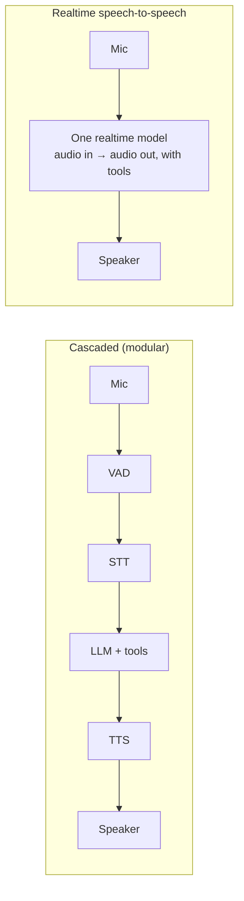
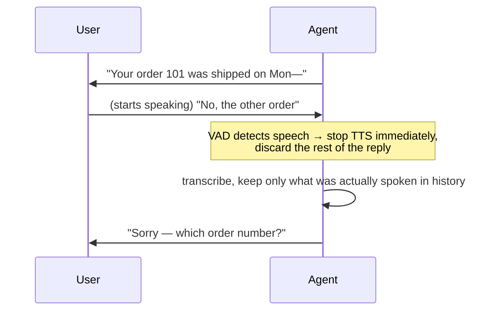

# Module 12B — Voice and Real-Time Agents [Crio]

> Ship · Week 27 · [Syllabus](../SYLLABUS.md#module-12b--voice-and-real-time-agents-week-27-crio)

**Goal:** build a support agent you can talk to. It listens, answers fast, handles interruptions and can take
actions, within a latency and cost budget.

## 12B.1 Speech basics

| Piece | Job | Local options | Hosted options |
|---|---|---|---|
| **VAD** (voice activity detection) | Detect when someone starts/stops speaking | Silero VAD | built into most platforms |
| **STT** (speech-to-text) | Audio → text | Whisper / faster-whisper | Deepgram, AssemblyAI, OpenAI |
| **LLM** | Decide what to say or do | Ollama | any chat API |
| **TTS** (text-to-speech) | Text → audio | Piper, Kokoro | ElevenLabs, Cartesia, OpenAI |

**Word error rate (WER)** = (substitutions + deletions + insertions) ÷ words in the reference. Lower is better.

```python
# uv add jiwer
import jiwer
print(jiwer.wer("my order number is one zero one", "my order number is one oh one"))   # 1 substitution / 7 words ≈ 0.14
```

## 12B.2 Cascaded pipeline vs realtime speech-to-speech



| | Cascaded | Realtime speech-to-speech |
|---|---|---|
| Latency | Sum of stages (aim < 1 s to first audio) | Lowest, most natural |
| Control and debugging | High: you see the transcript of every step | Lower |
| Mix-and-match vendors, local models | Yes | Mostly one vendor |
| Cost | Often lower | Usually higher per minute |
| Tone, emotion, interruptions | Harder | Better |

**Design choice:** start cascaded (debuggable, can run locally), then justify switching with measured latency and quality.

### Latency budget (cascaded, target ~800 ms to first audio)

| Stage | Budget | Tricks |
|---|---|---|
| End-of-speech detection | 200–300 ms | Tune VAD silence threshold |
| STT final transcript | 100–300 ms | Streaming STT |
| LLM first token | 200–400 ms | Small/fast model, short prompts, prompt caching |
| TTS first audio | 100–200 ms | Streaming TTS; speak the first sentence while the rest generates |

## 12B.3 A local cascaded loop (push-to-talk)

Learn the pieces before using a framework.

```python
# voice_loop.py   uv add faster-whisper sounddevice soundfile numpy ollama pyttsx3
import time
import numpy as np
import ollama
import pyttsx3
import sounddevice as sd
from faster_whisper import WhisperModel

stt = WhisperModel("base.en", compute_type="int8")     # small and fast on CPU
tts = pyttsx3.init()                                    # offline system voice (use Piper for better quality)
history = [{"role": "system", "content": "You are a friendly support agent. Answer in one or two short sentences."}]

def record(seconds=5, sr=16000) -> np.ndarray:
    print("🎙️  speak…")
    audio = sd.rec(int(seconds * sr), samplerate=sr, channels=1, dtype="float32")
    sd.wait()
    return audio.ravel()

while True:
    input("\nPress Enter to talk (Ctrl+C to quit)")
    audio = record()
    t0 = time.perf_counter()
    segments, _ = stt.transcribe(audio, language="en")
    text = " ".join(s.text for s in segments).strip()
    t1 = time.perf_counter()
    print("You:", text)
    history.append({"role": "user", "content": text})
    reply = ollama.chat(model="llama3.2:3b", messages=history).message.content
    t2 = time.perf_counter()
    history.append({"role": "assistant", "content": reply})
    print("Agent:", reply)
    print(f"⏱ STT {t1-t0:.2f}s · LLM {t2-t1:.2f}s")
    tts.say(reply); tts.runAndWait()
```

Add your Module 8 tools (e.g. `lookup_order`) to `ollama.chat(..., tools=...)` and the voice agent can act.

## 12B.4 LiveKit agents: real-time, streaming, interruptions

[LiveKit](https://livekit.io) is an open-source WebRTC platform. Its **Agents** framework handles streaming audio, VAD,
turn detection and barge-in for you. Use LiveKit Cloud's free tier or self-host the server.

```python
# agent.py   uv add "livekit-agents[openai,silero,deepgram,cartesia]" python-dotenv
from dotenv import load_dotenv
from livekit import agents
from livekit.agents import Agent, AgentSession, function_tool
from livekit.plugins import cartesia, deepgram, openai, silero

load_dotenv()   # LIVEKIT_URL, LIVEKIT_API_KEY, LIVEKIT_API_SECRET, plus STT/TTS keys


class SupportAgent(Agent):
    def __init__(self):
        super().__init__(instructions="You are a voice support agent. Be brief. Use tools for order data.")

    @function_tool
    async def lookup_order(self, order_id: int) -> str:
        """Get status and amount for an order id."""
        return {101: "shipped, ₹2,450", 102: "pending, ₹990"}.get(order_id, "no such order")


async def entrypoint(ctx: agents.JobContext):
    session = AgentSession(
        vad=silero.VAD.load(),
        stt=deepgram.STT(),                                  # streaming STT
        llm=openai.LLM.with_ollama(model="qwen2.5:7b"),      # local LLM via Ollama's OpenAI-compatible API
        tts=cartesia.TTS(),                                  # streaming TTS
        allow_interruptions=True,                            # barge-in: user can cut the agent off
    )
    await session.start(room=ctx.room, agent=SupportAgent())
    await session.generate_reply(instructions="Greet the caller and ask how you can help.")


if __name__ == "__main__":
    agents.cli.run_app(agents.WorkerOptions(entrypoint_fnc=entrypoint))
```

```bash
uv run agent.py console      # talk to it in your terminal
uv run agent.py dev          # connect to a LiveKit room; test in the LiveKit Agents Playground
```

LiveKit Agents releases often, and plugin names and parameters change. Check the current quick-start if an import fails.
For a realtime model, replace `stt`/`llm`/`tts` with a realtime LLM plugin.

## 12B.5 Interruptions and turn-taking



Patterns: stop audio within ~200 ms of user speech; record only the **spoken** part of the reply in history;
use a turn-detection model so the agent doesn't jump in during short pauses.

## 12B.6 Cost per minute and voice safety

```text
cost/min ≈ STT $/min + TTS $/min + (LLM tokens/min × $/token) + platform $/min
```

Measure, don't guess: log every stage per turn.

Voice-specific guardrails:
- Confirm risky actions verbally: "I'll refund ₹2,450 to order 101 — shall I go ahead?" and require a clear yes, plus human approval rules from Module 9.
- Don't read out PII (full card numbers, Aadhaar); mask it in transcripts.
- Disclose that the caller is talking to an AI, and offer a human hand-off.
- Watch for injection spoken aloud, the same as typed injection.

## Build — VoiceMate

1. Cascaded voice agent (LiveKit or your own loop) with 2 tools from Module 8.
2. Barge-in handling and a human hand-off command.
3. Write down your cascaded vs realtime decision, backed by measured latency.
4. Report: p50/p95 time-to-first-audio, task completion on 10 scripted calls, WER on 20 utterances, cost per minute.

## Checkpoint

- [ ] p95 time-to-first-audio measured; you know which stage is slowest.
- [ ] Interrupting the agent stops it within a fraction of a second.
- [ ] Risky actions require spoken confirmation.

## Further reading

- LiveKit Agents docs and examples
- Pipecat (alternative open-source voice-agent framework)
- faster-whisper, Piper TTS repositories
