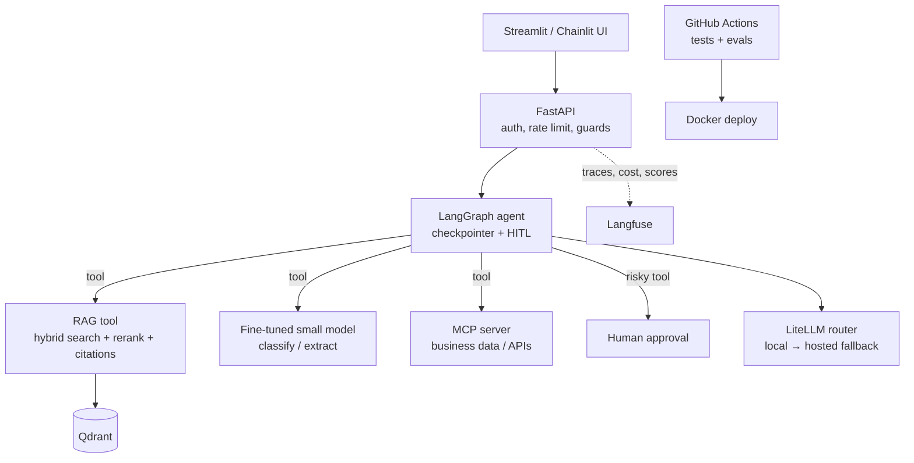
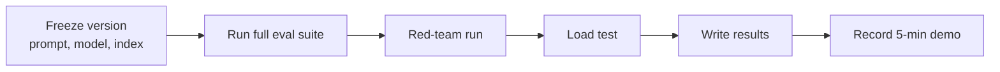

# Module 13 — Capstone Project

> Phase 6 · Weeks 23–24 · Level 4 Ship · [Syllabus](../SYLLABUS.md#module-13-capstone-project)

**Goal:** graduate with one production-ready AI system that integrates RAG, an agent, a fine-tuned model,
deployment and monitoring — and a demo you can walk any hiring manager through.

## 13.1 Architecture design

### Pick a problem (examples)

| Idea | RAG over | Agent tools | Fine-tuned model does |
|---|---|---|---|
| Policy & claims assistant (insurance) | Policy PDFs | Claim status lookup, premium calculator, create ticket (HITL) | Classify claim type / extract claim fields |
| IT helpdesk copilot | Runbooks, KB articles | Ticket search, system status API, restart service (HITL) | Triage tickets by priority |
| Government scheme advisor | Scheme documents (multilingual) | Eligibility calculator, office locator | Rewrite answers in simple Hindi/Marathi |
| Investment research assistant | Annual reports, filings | Price/ratio calculator, SQL on financials | Extract financial metrics as JSON |

Pick one where **you** have real documents and can judge answer quality.

### Reference architecture



### Design document (write before coding — 1–2 pages)

```markdown
# <Project name> — design
## Problem & users
## Success metrics (targets)      e.g. answer correctness ≥ 85%, groundedness ≥ 0.9, p95 < 5 s, cost < ₹1/query
## Data sources & DPDP data map
## Architecture (diagram) and why each component
## Tools the agent has, permissions, which need approval
## Model choices (local/hosted, fine-tuned) with benchmark evidence
## Evaluation plan (golden sets for retrieval, answers, agent trajectories)
## Risks & mitigations (OWASP LLM Top 10)
## Milestones
```

## 13.2 Milestone 1 — RAG system checkpoint

- Ingestion pipeline (parse, redact, chunk, embed, upsert with stable IDs)
- Hybrid retrieval + reranker + citations + abstention (Module 5)
- Retrieval eval (hit rate, precision@K, MRR) and RAGAS faithfulness on ≥ 30 questions
- ✅ Gate: meets your retrieval targets

## 13.3 Milestone 2 — Agent integration checkpoint

- LangGraph agent with RAG as a tool plus ≥ 2 other tools (one via MCP)
- Guards: step limit, loop detection, circuit breaker, permissions, injection defences
- HITL approval on at least one risky action + audit log
- Trajectory eval on ≥ 15 tasks
- ✅ Gate: task success target met; red-team suite passes

## 13.4 Fine-tuned model integration and deployment pipeline

- Fine-tuned small model (Module 7) served by Ollama, called as a tool or a pipeline step
- Comparison vs prompting a larger model (quality, latency, cost) in the decision log
- Docker Compose stack, GitHub Actions with eval gate, deployed endpoint
- Langfuse tracing with cost and quality scores

## 13.5 Final build, evaluation and demo



Final evaluation report table:

| Area | Metric | Target | Result |
|---|---|---|---|
| Retrieval | Hit rate@5 | ≥ 0.85 | |
| Answers | Faithfulness | ≥ 0.9 | |
| Answers | Correctness (judge) | ≥ 0.85 | |
| Agent | Task success | ≥ 0.8 | |
| Safety | Attacks blocked | 100% of suite | |
| Ops | p95 latency | ≤ 5 s | |
| Cost | Per query | ≤ target | |

Demo script (5 minutes): problem → live question with citations → multi-step agent task with visible trace → approval
gate → blocked injection attempt → monitoring dashboard → what you'd improve next.

## 13.6 Portfolio and career

Repository checklist:

- [ ] README: problem, demo GIF/video link, architecture diagram, how to run in 3 commands, results table
- [ ] `docs/design.md`, `docs/evaluation.md`, `docs/decision-log.md`
- [ ] `.env.example`, `docker-compose.yml`, CI badge
- [ ] Tests and eval scripts runnable by others
- [ ] No secrets or personal data in the repo history

Career assets:

- LinkedIn post: problem, architecture image, 3 numbers from your eval, demo link
- Resume bullet format: **built X using Y, measured Z** — e.g. *"Built a hybrid-search RAG assistant with LangGraph agents
  and a QLoRA-tuned 3B classifier; raised hit rate from 0.62 to 0.88 and cut cost per query 70% via routing."*
- Be ready to explain every design choice and one failure you debugged.

## Checkpoint

- [ ] All three milestones passed with evidence committed.
- [ ] Live endpoint + dashboard + demo video.
- [ ] Final evaluation report and README complete.
