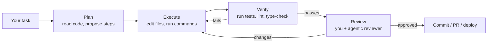

# Module 13A — Coding Agents [Crio]

> Advanced · Weeks 28–29 · [Syllabus](../SYLLABUS.md#module-13a--coding-agents-weeks-2829-crio)

**Goal:** use coding agents (Claude Code, Cursor, Codex, Copilot agent) as your main developer on a large,
unfamiliar codebase, safely and while staying accountable for quality.

## 13A.1 How a coding agent works

A coding agent is the Module 8 agent loop with tools for a codebase: **read files, search, edit, run commands,
run tests**. The *harness* is everything around the LLM: tools, permissions, context management, memory files and hooks.



The plan → execute → verify loop works only if the agent **can verify**. A repo with fast tests, a linter and clear
commands is a repo an agent can work in.

## 13A.2 Autonomy levels and safe permissions

| Level | Agent does | You do | Use for |
|---|---|---|---|
| 1 Suggest | Proposes edits | Accept each one | Learning a codebase, risky code |
| 2 Edit with approval | Edits, asks before commands | Approve commands | Normal feature work |
| 3 Auto-edit, gated commands | Edits and runs allow-listed commands | Review the diff | Well-tested repos |
| 4 Autonomous in a sandbox | Everything, in a container or worktree | Review the PR | Parallel agents, large refactors |

Permission rules in Claude Code (`.claude/settings.json`, committed for the team):

```json
{
  "permissions": {
    "allow": ["Bash(uv run pytest:*)", "Bash(uv run ruff:*)", "Bash(git diff:*)", "Bash(git status)"],
    "ask": ["Bash(git push:*)"],
    "deny": ["Read(./.env)", "Read(./secrets/**)", "Bash(rm -rf:*)", "Bash(curl:*)"]
  }
}
```

Rules of thumb: deny secrets, deny network tools by default, allow only the test, lint and build commands, and never run
level 4 on your real machine with production credentials.

## 13A.3 Project instruction files: CLAUDE.md and AGENTS.md

The agent reads these at the start of every session. It is onboarding for an engineer with no memory.

```markdown
# CLAUDE.md  (AGENTS.md has the same idea for other agents)

## Project
FastAPI service for grounded Q&A over company docs. Python 3.11, uv, Qdrant, Ollama in dev.

## Commands
- Install: `uv sync`
- Test: `uv run pytest -q` (offline; uses FakeLLM — never call a real model in tests)
- Lint/format: `uv run ruff check . && uv run ruff format .`
- Eval gate: `uv run python eval.py --min-hit-rate 0.8`

## Conventions
- Pydantic models for all request/response bodies (src/schemas.py)
- New tools go in src/tools/, one file per tool, with a test
- Never log raw prompts containing user PII; use redact() from src/pii.py

## Don't
- Don't edit migrations by hand; don't change public API shapes without updating docs/api.md
```

Keep it short and specific. Add a line every time the agent makes the same mistake twice.

## 13A.4 Hooks and MCP

**Hooks** run your scripts automatically at points in the agent loop. They are deterministic guardrails, not "please remember to…".

```json
{
  "hooks": {
    "PostToolUse": [
      { "matcher": "Edit|Write",
        "hooks": [{ "type": "command", "command": "uv run ruff format . --quiet" }] }
    ],
    "PreToolUse": [
      { "matcher": "Bash",
        "hooks": [{ "type": "command", "command": "python .claude/hooks/block_dangerous.py" }] }
    ]
  }
}
```

```python
# .claude/hooks/block_dangerous.py — exit code 2 blocks the tool call and tells the agent why
import json, re, sys
cmd = json.load(sys.stdin).get("tool_input", {}).get("command", "")
if re.search(r"\b(drop\s+table|git\s+push\s+--force|rm\s+-rf\s+/)", cmd, re.I):
    print("Blocked by policy: destructive command", file=sys.stderr)
    sys.exit(2)
```

**MCP in coding agents:** give the agent your issue tracker, docs or database (read-only) through MCP servers.
This is the same protocol as Module 11:

```bash
claude mcp add github -- npx -y @modelcontextprotocol/server-github
```

## 13A.5 Parallel agents

Split a task into independent parts and run one agent per part, each in its own **git worktree** so they don't collide:

```bash
git worktree add ../repo-api   -b feat/api
git worktree add ../repo-tests -b feat/tests
# run one agent session in each folder, then review and merge the branches
```

Or use the harness's built-in sub-agents. Parallelism pays off only when the parts truly don't depend on each other
and each has its own way to verify.

Headless runs for scripts and CI:

```bash
claude -p "Run the test suite, fix any failing test caused by src/tools/, and summarise the changes" \
  --allowedTools "Edit" "Bash(uv run pytest:*)"
```

## 13A.6 Tests written with agents

- **Write the test first, then the code:** ask the agent for failing tests from the spec, review **them**, then let it implement.
- **Behavioural tests** check what users see (API response, UI flow). **Functional tests** check units.
- Watch for the classic failure: an agent that "fixes" a failing test by weakening the test. Review every diff to `tests/`.
- For AI features, add **eval cases** (Module 3) next to unit tests.

## 13A.7 Agentic code review and audits

Use a second agent session (fresh context) as a reviewer with a checklist:

```text
Review the diff on this branch against main as a senior engineer.
Report: correctness bugs, missing tests, security issues (injection, secrets, authz),
performance problems, and deviations from CLAUDE.md conventions.
For each finding: file:line, severity, and a concrete fix. Do not edit files.
```

Run separate passes for **security** (OWASP, secrets, authz at every endpoint) and **architecture** (layering,
coupling, duplicated logic). You remain the final reviewer: read the diff, run it, and check it against the spec.

## Common failure modes

| Failure | Defence |
|---|---|
| Wanders off-task, edits unrelated files | Narrow task, plan approval first, review `git diff --stat` |
| Invents APIs or library functions | Tests and type checks in the loop; point it to docs |
| Weakens or deletes tests to pass | Review test diffs; hook that flags changes to `tests/` |
| Loses context on long tasks | Smaller tasks, notes file, fresh session per subtask |
| Leaks secrets or runs destructive commands | Permission deny rules + PreToolUse hooks + sandbox |

## Build — RepoAgent

1. Pick a mid-size open-source Python repo with tests and an issue labelled *good first issue* or *help wanted*.
2. Write a one-page spec for the change.
3. Add a CLAUDE.md for your fork; set permissions and one formatting hook.
4. Plan with the agent → implement → tests → agentic review + security pass → fix findings.
5. Open a merge-quality PR (upstream if the maintainers want it).
6. Retrospective: time-to-PR, tokens/cost, what the agent got wrong and how you caught it.

## Checkpoint

- [ ] PR with passing tests and a clear description.
- [ ] All review findings closed or explained.
- [ ] A written list of agent failure modes you saw and your defences.

## Further reading

- Claude Code docs (memory/CLAUDE.md, settings and permissions, hooks, MCP, sub-agents, headless mode)
- Anthropic engineering blog: *Claude Code best practices*
- AGENTS.md convention (agents.md)
