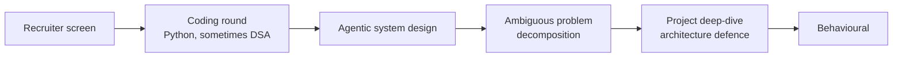
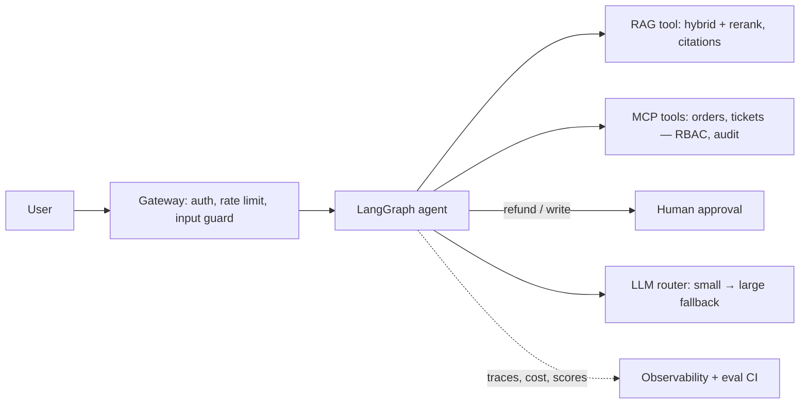

# Module 14 — Interview Sprint [Crio]

> Career · Week 32 · [Syllabus](../SYLLABUS.md#module-14--interview-sprint-week-32-crio)

**Goal:** prepare for AI Engineer and Forward Deployed Engineer (FDE) interviews the way AI companies, GCCs and startups
run them, using your own projects as evidence.

## Typical interview loop

## 14.1 Agentic system-design rounds

Use one framework every time:

1. **Clarify:** users, scale (requests/day), latency target, data sources, sensitivity (PII?), what "good" means.
2. **Requirements:** functional and non-functional (latency, cost, compliance, availability).
3. **High-level design:** draw the boxes: ingestion, retrieval, agent, tools, guardrails, observability.
4. **Deep-dive on 2 parts:** retrieval strategy, agent loop, tool permissions, memory.
5. **Evaluation:** golden sets, metrics, CI gate, online feedback.
6. **Failure modes and safety:** injection, hallucination, tool abuse, fallbacks, HITL.
7. **Cost and scale:** routing, caching, model choice, batching.
8. **Trade-offs and what you'd do next.**

### Practice prompts

| Prompt | Must mention |
|---|---|
| Design a research agent that writes a cited report from the web | Planner–executor, source dedup, citation checking, step budget, judge eval |
| Text-to-SQL for business users over a 200-table warehouse | Schema retrieval, semantic layer, read-only sandbox, verification loop, golden query set, hallucinated-column rate |
| Customer-support agent for a bank (India) | RAG over policies, RBAC tools via MCP, HITL on money movement, DPDP, audit trail, escalation |
| Multi-agent claims-processing pipeline | Supervisor, specialist agents, confidence thresholds, human review routing, cost per claim |
| Reduce LLM cost by 50% without losing quality | Measure first, routing, semantic + prompt caching, smaller fine-tuned model, eval gate |
| Voice agent for appointment booking | Cascaded vs realtime, latency budget, barge-in, confirmation of actions |

A reference answer sketch, for a support agent:

## 14.2 Ambiguous-problem decomposition

Prompt style: *"Our sales team wastes time on proposals. Use AI to fix it."* Score yourself on:

1. **Clarifying questions** (at least 5): who, what volume, what inputs exist, what does a good proposal look like, constraints.
2. **Decompose** into sub-problems: retrieve past proposals, draft sections, check pricing rules, human review.
3. **Propose a 4-week scope:** week 1 data and baseline eval, week 2 RAG draft, week 3 review workflow, week 4 pilot with 3 users.
4. **Success metrics:** time saved per proposal, edit distance of final vs draft, win rate (lagging).
5. **Riskiest assumption** and how you'd test it first: "past proposals are accessible and good enough to learn from".

## 14.3 Security and architecture interrogation

Be ready for questions like these:

- How do you stop prompt injection from a retrieved document from triggering a tool call?
- A customer asks you to delete their data. Where does it live in your system (vector DB, logs, traces, fine-tuning data)?
- How does tenant A never see tenant B's data in your MCP server?
- What happens when your model provider is down?
- How would you know the system got worse after a model upgrade?
- Why did you choose X (Qdrant, LangGraph, QLoRA) over Y?

Answer with your design **and** evidence from your projects (Module 11 red-team report, Module 12 dashboards).

## 14.4 Behavioural rounds

Use **STAR** (Situation, Task, Action, Result), with a number in the result. Prepare 6 stories:

| Theme | Example from this course |
|---|---|
| Debugged a hard problem | RAG answered wrongly → failure taxonomy → fixed chunking; hit rate 0.62 → 0.88 |
| Made a trade-off | Chose a fine-tuned 1.5B model over a frontier API: 90% of quality at 10% of cost |
| Handled failure | Agent looped in production → added loop detection and step budget |
| Disagreed / pushed back | Argued for an eval gate before shipping |
| Learned something fast | Shipped the voice agent in a week |
| Explained tech to non-tech people | Demoed the capstone to a non-technical audience |

## 14.5 Portfolio walkthrough and architecture defence

A 5-minute capstone walkthrough:

1. Problem and user (30 s)
2. Live demo (2 min)
3. Architecture diagram and the two key decisions (1 min)
4. Results table: eval metrics, latency, cost (1 min)
5. What broke and what you'd do next (30 s)

**Résumé bullets:** *verb + what you built + with what + measured result.*
Example: *"Built a multi-tenant MCP server with RBAC and audit logging used by a 4-agent helpdesk system; 38%
ticket deflection at ₹1.2 per ticket."*

**LinkedIn:** headline with your target role, a featured section linking the capstone demo, and one post per major build.

## Optional tracks [Crio]

| Track | Why | Free resources |
|---|---|---|
| Data Structures & Algorithms | Many companies still run a coding round | NeetCode 150 roadmap, LeetCode |
| System Design (LLD + HLD) | Classic backend design questions | *System Design Primer* (GitHub), *Designing Data-Intensive Applications* |

## Checkpoint

- [ ] 3 agentic system-design mocks done out loud (record yourself or practise with a friend).
- [ ] 2 decomposition mocks with a written 4-week scope.
- [ ] 6 STAR stories with numbers.
- [ ] 5-minute capstone walkthrough rehearsed; résumé and LinkedIn updated.
