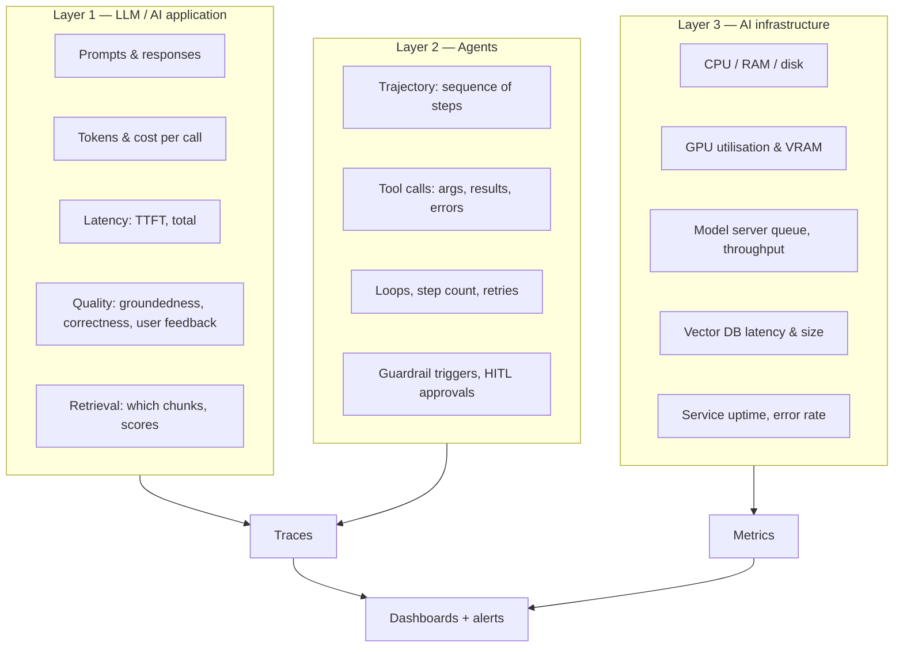
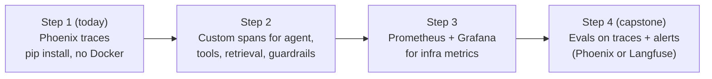

# Observability for AI, AI Agents and AI Infrastructure

> Companion to [Module 12](12-deployment-and-observability.md) · Working demo: [`projects/observability-demo`](../projects/observability-demo/)

**Bottom line:** start with **Arize Phoenix** for AI and agent tracing. It is one `pip install`, runs locally
with no Docker or account, and uses OpenTelemetry, so what you learn transfers to every other tool. Add
**Prometheus + Grafana** later for infrastructure metrics.

---

## 1. What "observability" means for AI systems

Traditional apps: is it up, is it fast, are there errors? AI apps add: **is the answer good, grounded, safe, and
what did it cost?** And agents add: **what did it decide to do, and why?**



| Signal | What it is | Best for |
|---|---|---|
| **Trace** | One request as a tree of timed **spans** (agent → LLM call → tool → retrieval) | Debugging a single bad answer; seeing agent decisions |
| **Metric** | A number over time (p95 latency, tokens/min, GPU %) | Dashboards, alerts, capacity |
| **Log** | Event lines | Detail and audit trails |
| **Eval / score** | Quality judgement attached to a trace | Tracking whether answers are getting worse |

## 2. The options

### LLM and agent observability (traces and evals)

| Tool | Open source / self-host | Setup effort | Strengths | Watch out |
|---|---|---|---|---|
| **Arize Phoenix** | Yes, runs as a single process | **Lowest**: `pip install`, `phoenix serve` | OpenTelemetry-native; auto-instrumentation for OpenAI, LangChain, LlamaIndex, CrewAI and more; span kinds for agent, tool, retriever and guardrail; built-in evals | Less focus on prompt management and user analytics than Langfuse |
| **Langfuse** | Yes (Docker Compose: Postgres, ClickHouse, Redis, S3) + free cloud | Medium | Prompt management, sessions and users, cost tracking, datasets, scores | Self-hosting has several services; the SDK changed between v2 and v3 |
| **LangSmith** | Cloud (self-host is enterprise) | Low if you use LangChain | Deep LangChain/LangGraph integration | Proprietary, limited free tier |
| **OpenLIT** | Yes | Low–medium | OpenTelemetry-native, includes GPU metrics | Smaller community |
| **Opik** (Comet) | Yes | Medium | Tracing plus evals and guardrails | Newer |
| **W&B Weave**, **MLflow Tracing** | MLflow yes / Weave cloud | Low–medium | Good if you already use W&B or MLflow for training | Less agent-specific |
| **Helicone** | Yes | Low (proxy) | Change a base URL and every call is logged | Proxy only sees LLM calls, not your tools |
| Datadog / New Relic / Dynatrace LLM Observability | Commercial | Low if already a customer | One place with the rest of company monitoring | Cost |

All serious options now speak **OpenTelemetry** (the OpenInference or OTel GenAI semantic conventions). Instrument
once with OTel, and you can switch backends later without touching application code.

### Infrastructure observability (metrics)

| What | Tool | Notes |
|---|---|---|
| Collect & store metrics | **Prometheus** | Pulls `/metrics` endpoints every few seconds |
| Dashboards & alerts | **Grafana** | Import ready-made dashboards (Node Exporter Full, DCGM) |
| Host CPU/RAM/disk | node-exporter | One container |
| NVIDIA GPU | DCGM exporter / nvidia_gpu_exporter | Utilisation, VRAM, temperature, power |
| Model servers | vLLM and TGI expose `/metrics` natively | Queue length, tokens/s, time to first token |
| Ollama | No native Prometheus endpoint | Measure from your app (as the demo does) or use a community exporter |
| Vector DB | Qdrant exposes `/metrics` | Search latency, collection size |
| Managed option | Grafana Cloud free tier | No servers to run |

## 3. Recommendation for this course



Why Phoenix first:

1. **Easiest to run.** `uv run phoenix serve` gives a UI at <http://localhost:6006>. It needs no Docker, database or account.
2. **Auto-instrumentation.** One `register(auto_instrument=True)` call traces every OpenAI-compatible call. That includes **Ollama**, Groq and OpenAI.
3. **Agent-aware.** The UI shows AGENT → LLM → TOOL → RETRIEVER as a tree, with the documents and scores.
4. **OpenTelemetry standard.** It is not a lock-in, and moving to Langfuse later means changing the endpoint.

---

## 4. Implementation, step by step

The full working code is in [`projects/observability-demo/app.py`](../projects/observability-demo/app.py). It is a
small RAG + tool-calling agent that uses Ollama through its OpenAI-compatible API.

### Step 0 — prerequisites

```bash
ollama pull qwen2.5:7b          # chat model with tool calling
ollama pull nomic-embed-text    # embeddings
cd projects/observability-demo
uv sync                         # installs Phoenix, OpenInference, openai, prometheus-client
```

### Step 1 — start Phoenix and turn on auto-tracing

```bash
uv run phoenix serve            # terminal 1 → http://localhost:6006
```

```python
from phoenix.otel import register

tracer_provider = register(
    project_name="rag-agents-masterclass",
    endpoint="http://localhost:6006/v1/traces",
    auto_instrument=True,   # every OpenAI-client call (chat + embeddings) becomes an LLM/EMBEDDING span
    batch=True,
)
tracer = tracer_provider.get_tracer(__name__)
```

These lines alone give you every prompt, response, token count and latency. Point the OpenAI client at Ollama:

```python
from openai import OpenAI
client = OpenAI(base_url="http://localhost:11434/v1", api_key="ollama")
```

### Step 2 — add spans for agents, tools, retrieval and guardrails

Auto-instrumentation only sees LLM calls. Decorators make **your** code visible:

```python
@tracer.agent              # the whole agent run: input, output, duration
def run_agent(question: str) -> str: ...

@tracer.tool               # each tool call: arguments, result, errors
def calculator(expression: str) -> str: ...

@tracer.guardrail          # guard decisions show up in the trace
def input_guard(question: str) -> bool: ...
```

Retrieval gets a span with the retrieved documents and scores. Phoenix shows these as a ranked list:

```python
from openinference.semconv.trace import SpanAttributes

with tracer.start_as_current_span("retrieve", openinference_span_kind="retriever") as span:
    span.set_input(query)
    for i, (score, text) in enumerate(hits):
        span.set_attribute(f"{SpanAttributes.RETRIEVAL_DOCUMENTS}.{i}.document.content", text)
        span.set_attribute(f"{SpanAttributes.RETRIEVAL_DOCUMENTS}.{i}.document.score", score)
```

Run it:

```bash
uv run python app.py            # terminal 2 — asks 4 demo questions
```

What one agent trace looks like in Phoenix:

```text
run_agent  (AGENT)                          "What is 18% GST on Rs 2450?"
├── input_guard  (GUARDRAIL)                 → true
├── ChatCompletion  (LLM)                    50 → 12 tokens · decides to call calculator
├── calculator  (TOOL)                       {"expression": "2450*0.18"} → 441.0
└── ChatCompletion  (LLM)                    answer
```

Verified result: a test run of `app.py` produced **20 spans across 4 traces** in Phoenix. They were 4 AGENT,
4 GUARDRAIL, 6 LLM, 2 EMBEDDING, 1 RETRIEVER and 3 TOOL spans, all with token counts and retrieved documents.
The injection question was stopped at the guardrail, with no LLM call. In that run, a stand-in server
replaced Ollama.

### Step 3 — infrastructure metrics with Prometheus + Grafana

`app.py` also exposes Prometheus metrics on <http://localhost:8001/metrics> while it runs:

```python
from prometheus_client import Counter, Histogram, start_http_server

REQUESTS = Counter("agent_requests_total", "Agent requests", ["status"])   # ok / blocked / error / step_limit
LATENCY = Histogram("agent_latency_seconds", "End-to-end agent latency")
TOKENS = Counter("llm_tokens_total", "LLM tokens", ["model", "kind"])
TOOL_CALLS = Counter("agent_tool_calls_total", "Tool calls", ["tool", "status"])
start_http_server(8001)
```

Start the infra stack (Phoenix, Prometheus, node-exporter, Grafana):

```bash
docker compose up -d
```

In Grafana (<http://localhost:3000>, admin/admin): add the Prometheus data source `http://prometheus:9090`.
Import the dashboard *Node Exporter Full* (ID 1860) for the host. Then build panels with these queries:

| Panel | PromQL |
|---|---|
| Requests per minute by status | `sum by (status) (rate(agent_requests_total[5m])) * 60` |
| p95 agent latency | `histogram_quantile(0.95, sum by (le) (rate(agent_latency_seconds_bucket[5m])))` |
| Tokens per minute | `sum by (kind) (rate(llm_tokens_total[5m])) * 60` |
| Tool error rate | `sum(rate(agent_tool_calls_total{status="error"}[5m])) / sum(rate(agent_tool_calls_total[5m]))` |
| Host memory used % | `100 * (1 - node_memory_MemAvailable_bytes / node_memory_MemTotal_bytes)` |

GPU machine: add the NVIDIA DCGM exporter container and import Grafana dashboard 12239. vLLM exposes its own
`/metrics` endpoint, so add it as another scrape target.

(The Docker Compose stack is provided as configuration but was not run in the authoring environment.)

### Step 4 — quality evals on traces (next)

Phoenix can run LLM-judge evals (hallucination, QA correctness, relevance) over collected traces and attach
the scores to them. Use the **Evals** tab in the UI or the `phoenix.evals` package. It works with a local judge
model through the OpenAI-compatible endpoint. This connects Module 3 (evals) with monitoring: you can watch
quality over time, not just latency.

---

## 5. What to alert on

| Alert | Threshold (starting point) | Layer |
|---|---|---|
| Error rate | > 2% over 5 min | App |
| p95 latency | > your target (e.g. 5 s) | App |
| Tokens or cost per hour | > 2× normal | App |
| Guardrail blocks | Sudden spike (attack?) | Agent |
| Agent step-limit hits | > 5% of runs (looping) | Agent |
| Tool error rate | > 5% | Agent |
| Groundedness score | Drops below baseline | Quality |
| Host memory / GPU VRAM | > 90% | Infra |
| Model server queue | Growing for > 5 min | Infra |

Prometheus Alertmanager or Grafana alerting can send these to email, Slack or Telegram.

## 6. Production checklist

- [ ] Every request has a trace ID that is returned in response headers, so users can report it
- [ ] Traces record prompt version, model and index version
- [ ] PII is masked in traces: set `OPENINFERENCE_HIDE_INPUTS=true` or `OPENINFERENCE_HIDE_OUTPUTS=true`, or redact before logging (DPDP, Module 11)
- [ ] Sampling for high traffic (trace 10–20% of requests, but 100% of errors)
- [ ] A retention period is set for traces and logs
- [ ] Dashboards: requests, latency, tokens/cost, errors, quality, infra
- [ ] Alerts are routed to someone who will act on them
- [ ] Phoenix or Langfuse is persisted (Docker volume or Postgres), not an in-memory dev server

## 7. Moving to Langfuse later

The application code stays the same. Langfuse accepts OpenTelemetry traces, so you point the OTel exporter at
Langfuse's OTLP endpoint, or you use the Langfuse SDK shown in Module 12. Choose Langfuse when you need
prompt management, user and session analytics, or a shared team deployment.

## Resources

- Arize Phoenix docs — <https://arize.com/docs/phoenix>
- OpenInference (semantic conventions and instrumentors) — <https://github.com/Arize-ai/openinference>
- OpenTelemetry GenAI semantic conventions — <https://opentelemetry.io/docs/specs/semconv/gen-ai/>
- Langfuse docs — <https://langfuse.com/docs>
- Prometheus — <https://prometheus.io/docs/> · Grafana dashboards — <https://grafana.com/grafana/dashboards/>
- NVIDIA DCGM exporter — <https://github.com/NVIDIA/dcgm-exporter>
